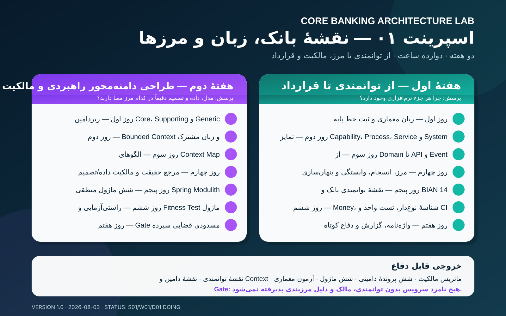

# Sprint 01 — نقشهٔ بانک، زبان و مرزها

- Weeks: 01–02
- Status: **Doing**
- Outcome: عبور مستدل از Capability به Domain، Bounded Context، Module/Service و Contract

## هفته‌ها

1. [Week 01 — Capability تا API/Event](week-01-capability-to-contract/README.md)
2. [Week 02 — Strategic DDD و مالکیت](week-02-strategic-ddd-ownership/README.md)

از Week 02، ریل اصلی هر هفته بدون کاهش با دو خروجی افزوده تکمیل می‌شود: Code Craft Lab و پروندهٔ مستند یک Core Banking/سامانهٔ بانکی واقعی. استاندارد مشترک در [الحاقیهٔ هفتگی](../../docs/course/expanded-weekly-tracks.md) ثبت شده است.

## خروجی اسپرینت

- Banking Capability Map v1
- Domain Map و Context Map v1
- واژه‌نامهٔ حداقل ۴۰ اصطلاح
- Data/Decision Ownership Matrix v1
- شش پروندهٔ دامینی اولیه
- شش ماژول منطقی Spring Modulith
- Architecture Fitness Test

## Gate

برای قابلیت «مسدودی قضایی سپرده» باید بدون شروع از جدول یا نام سرویس، این زنجیره دفاع شود:

~~~text
Capability → Domain/Subdomain → Bounded Context → Module/Service
           → Use Case → Command/Query → API/Event
~~~

هیچ Service Candidate بدون Capability، مالک کسب‌وکار و دلیل Boundary پذیرفته نمی‌شود.
