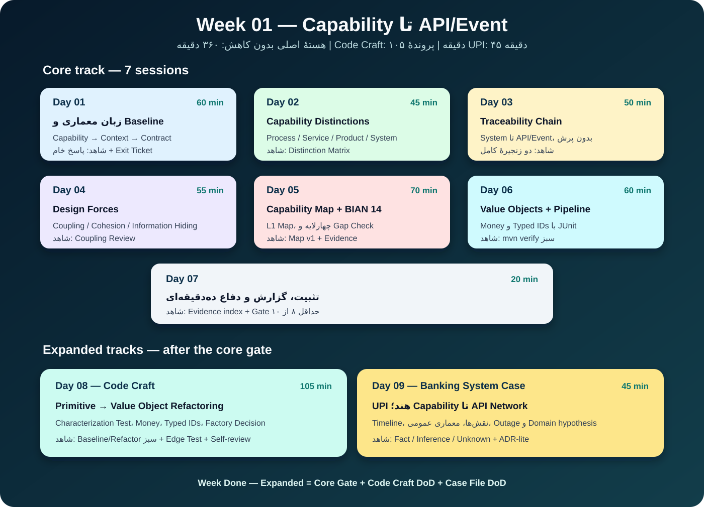

# Week 01 — Capability تا API/Event

- Status: **Ready — پاسخ‌های Day 01 حفظ شده‌اند؛ ادامه از Day 02**
- Core time budget: **360 minutes — unchanged**
- Expansion budget: **150 minutes — 105 Code Craft + 45 Case File**
- Full expanded budget: **510 minutes**
- Banking lens: اعطای تسهیلات، مسدودی قضایی سپرده، انتقال وجه و UPI
- Main question: چگونه از «بانک باید چه کاری بتواند انجام دهد؟» به Contract قابل اجرا و قابل‌ردیابی می‌رسیم؟
- Technical outcome: Value Objectهای بانکی، تست‌های JUnit و Pipeline سبز `mvn verify`



## چرا این هفته وجود دارد؟

بیشتر خطاهای معماری Core Banking پیش از انتخاب Kafka، دیتابیس یا Kubernetes رخ می‌دهند: مسئله با نام سامانه، جدول، واحد سازمانی یا Vendor اشتباه گرفته می‌شود و سپس از روی همان نام‌ها Service ساخته می‌شود. Week 01 یک زبان مشترک و یک زنجیرهٔ قابل‌ممیزی می‌سازد:

```text
Capability
  → Domain / Subdomain
  → Bounded Context
  → Module / Service Candidate
  → Use Case
  → Command / Query
  → API / Event
```

این زنجیره یک Pipeline مکانیکی یا نگاشت یک‌به‌یک نیست. در هر گام باید مسئله، مالک تصمیم، مالک داده، مرز تغییر و دلیل Contract روشن باشد.

## وضعیت فعلی تو

درس و Exit Ticket روز اول قبلاً شروع شده‌اند. پاسخ خام روز اول، حتی اگر ناقص یا نیازمند اصلاح باشد، **نباید پاک یا با پاسخ صیقلی جایگزین شود**؛ همان پاسخ خط پایه در Week 24 برای سنجش رشد استفاده خواهد شد. ابتدا پرسش‌های باقی‌ماندهٔ Day 01 را تمام کن، سپس از Day 02 ادامه بده.

## قانون اجرای هر روز

1. بخش `Before` تمرین یا Workbook را بدون مراجعه به درس پاسخ بده، اگر برای آن روز تعریف شده است.
2. درس را یک‌بار پیوسته بخوان و مثال هدایت‌شده را خودت بازسازی کن.
3. تمرین مستقل را در [Week 01 Workbook](submissions/week-01-workbook.md) انجام بده.
4. درس و Artifact را ببند و Exit Ticket را بدون مراجعه پاسخ بده.
5. پاسخ خام را نگه دار؛ Review و Revision زیر آن اضافه می‌شوند.
6. روز فقط وقتی `Done` است که شاهد پایان آن قابل بازکردن باشد.

## ترتیب دقیق هستهٔ اصلی

| روز | زمان | درس | تمرین و شاهد پایان | آزمون خروج |
|---|---:|---|---|---|
| ۱ | ۶۰ دقیقه | [زبان معماری و خط پایه](lessons/day-01-architecture-language-fa.md) | [Architecture Baseline](exercises/day-01-baseline.md) و پاسخ موجود | [Exit Ticket](quizzes/day-01-exit-ticket.md) |
| ۲ | ۴۵ دقیقه | [Capability در برابر Process، Service و System](lessons/day-02-capability-distinction-fa.md) | [Distinction Matrix](exercises/day-02-capability-distinction.md) | [Exit Ticket](quizzes/day-02-exit-ticket.md) |
| ۳ | ۵۰ دقیقه | [از System تا Contract و Traceability](lessons/day-03-traceability-chain-fa.md) | [دو Traceability Chain](exercises/day-03-traceability-chain.md) | [Exit Ticket](quizzes/day-03-exit-ticket.md) |
| ۴ | ۵۵ دقیقه | [Coupling، Cohesion، Encapsulation و Information Hiding](lessons/day-04-design-forces-boundary-fa.md) | [Coupling Review](exercises/day-04-coupling-review.md) | [Exit Ticket](quizzes/day-04-exit-ticket.md) |
| ۵ | ۷۰ دقیقه | [Banking Capability Map و BIAN 14](lessons/day-05-banking-capability-map-bian-fa.md) | [Capability Map v1 + Gap Check](exercises/day-05-capability-map-bian-gap-check.md) | [Exit Ticket](quizzes/day-05-exit-ticket.md) |
| ۶ | ۶۰ دقیقه | [Value Object و Pipeline](lessons/day-06-value-objects-pipeline-fa.md) | [Money و Typed IDs](exercises/day-06-value-objects.md) | [Exit Ticket](quizzes/day-06-exit-ticket.md) |
| ۷ | ۲۰ دقیقه | [تثبیت و دفاع Week 01](lessons/day-07-week-defense-fa.md) | [دفاع ده‌دقیقه‌ای](exercises/day-07-week-defense.md) | Rubric داخل Gate |
| **جمع هسته** | **۳۶۰ دقیقه** |  |  |  |

ریزبودجه‌ها شامل درس، تمرین و Exit Ticket هستند. دفاع و Review استاد پس از Submission جزو بودجهٔ خودخوان حساب نشده‌اند.

## مسیر افزودهٔ Week 01

هفت روز بالا برنامهٔ اصلی‌اند و هیچ بخشی از آن‌ها با جلسات زیر جایگزین نمی‌شود. بعد از Day 07 دو جلسهٔ افزوده را انجام بده:

| جلسه | زمان | محتوا | تمرین و شاهد پایان | آزمون/دفاع |
|---|---:|---|---|---|
| ۸ | ۱۰۵ دقیقه | [Clean Code و Refactoring از Primitive به Value Object](lessons/day-08-clean-code-value-object-refactoring-fa.md) | [Runnable Money Refactoring Kata](exercises/day-08-money-refactoring-kata.md) + [Code Review Checklist](artifacts/day-08-code-review-checklist.md) | [Exit Ticket](quizzes/day-08-exit-ticket.md) |
| ۹ | ۴۵ دقیقه | [پروندهٔ UPI هند؛ از Capability تا شبکهٔ API](case-studies/week-01-upi-fa.md) | [Capability/Contract Review](exercises/day-09-upi-capability-contract-review.md) | دفاع پنج‌سؤالی داخل پرونده |
| **جمع افزوده** | **۱۵۰ دقیقه** |  |  |  |

Starter اجرایی Day 08 در Test scope قرار دارد تا ابتدا رفتار موجود را تثبیت و سپس Refactor کنی:

```text
backend/banking-modulith/src/test/java/
└── com/example/corebankinglab/craftsmanship/week01/
    ├── PrimitiveTransferRequest.java
    └── PrimitiveTransferRequestCharacterizationTest.java
```

قواعد دائمی دو ریل افزوده در [الحاقیهٔ Code Craft و Case File](../../../docs/course/expanded-weekly-tracks.md) آمده است.

## خروجی‌های اجباری پایان Week 01

### تحلیل و معماری

- [Distinction Matrix](artifacts/distinction-matrix-template.md) برای Capability، Process، Business Service، System و Contract
- دو [Traceability Chain](artifacts/traceability-chain-template.md) برای مسدودی قضایی و اعطای تسهیلات
- [Coupling Review](artifacts/coupling-review-template.md) یک طراحی کاپل‌شده
- [Capability Map v1](artifacts/capability-map-working-draft.md) در سطح L1
- [BIAN Gap Check](artifacts/bian-gap-check-template.md) با ثبت Match، Gap و False Friend
- [Glossary](artifacts/glossary.md) با حداقل ۴۰ اصطلاح
- پاسخ خط پایهٔ سه سناریوی نهایی، بدون پاک‌کردن نسخهٔ خام

### کد و تست

- `Money`، `AccountId`، `CustomerId` و `BranchId` بدون وابستگی به Spring/JPA
- تست Equality عددی Money، Currency mismatch، ورودی نامعتبر و Rounding صریح
- Baseline سبز و Refactor مرحله‌ای Kata روز هشتم
- حداقل یک Edge Test تازه و Pattern Decision دربارهٔ Value Object و Static Factory
- Pipeline اولیهٔ `mvn verify` سبز

### پرونده و دفاع

- [Week 01 Report](artifacts/week-01-report-template.md)
- دفاع حداکثر ده‌دقیقه‌ای از زنجیرهٔ Capability تا Contract
- UPI Architecture Review با تفکیک `FACT`، `INFERENCE` و `UNKNOWN`

## Definition of Done

Week 01 زمانی `Done — Expanded` است که:

- تفاوت Capability، Process، Business Service، System، API و Event با مثال بانکی توضیح داده شود.
- زنجیرهٔ Capability تا API/Event برای دو سناریو قابل‌ردیابی باشد.
- هیچ Service Candidate بدون Capability، مسئولیت منسجم و مالک تصمیم معرفی نشده باشد.
- نقش BIAN به‌عنوان Reference Model و Gap Check، نه Deployment Blueprint، دفاع شود.
- Capability Map از نام نرم‌افزار، Vendor، جدول و چارت سازمانی مستقل باشد.
- Value Objectها Equality و ورودی نامعتبر را آزمون کنند و Rounding پنهان نداشته باشند.
- Baseline و نسخهٔ Refactored Code Craft هر دو سبز باشند و Complexity اضافه‌شده ثبت شود.
- پروندهٔ UPI دست‌کم یک شکست عملیاتی، Timeline مستند و Current State تاریخ‌دار داشته باشد.
- `mvn verify` سبز باشد.
- دفاع Week 01 حداقل ۸ از ۱۰ بگیرد و Critical Error نداشته باشد.

## Critical Errorهای این هفته

هرکدام از موارد زیر Gate را متوقف می‌کند:

1. نام سامانه، تیم، جدول یا API به‌عنوان Capability معرفی شود.
2. BIAN Service Domain به‌طور خودکار یک Microservice یا Bounded Context قطعی فرض شود.
3. از وجود یک Entity مشترک، مالکیت مشترک نتیجه گرفته شود.
4. API/Event بدون Use Case، Owner و معنای کسب‌وکاری معرفی شود.
5. Money با `double` یا Rounding پنهان مدل شود.
6. Pattern صرفاً برای نمایش دانش اضافه شود و Alternative ساده‌تر بررسی نشود.

## خارج از محدوده

این موضوعات عمداً به هفته‌های بعد موکول شده‌اند:

- تعیین Context Map نهایی و طبقه‌بندی Core/Supporting/Generic
- استخراج Microservice و انتخاب مرز Deployment
- طراحی Aggregate و Transaction Boundary کامل
- انتخاب REST در برابر Kafka
- Saga، Outbox، Idempotency و Reconciliation
- طراحی سند حسابداری و مدل فیزیکی دیتابیس

در Week 01 فقط واژه، Traceability، Quality of Boundary و Type safety را می‌سازیم؛ راه‌حل توزیع‌شده را زودتر از مسئله انتخاب نمی‌کنیم.

## منابع

مسیر مطالعهٔ محدود و هدفمند در [References](references/README.md) آمده است. برای UPI، Source Register تاریخ‌دار داخل خود پرونده نگهداری می‌شود.

