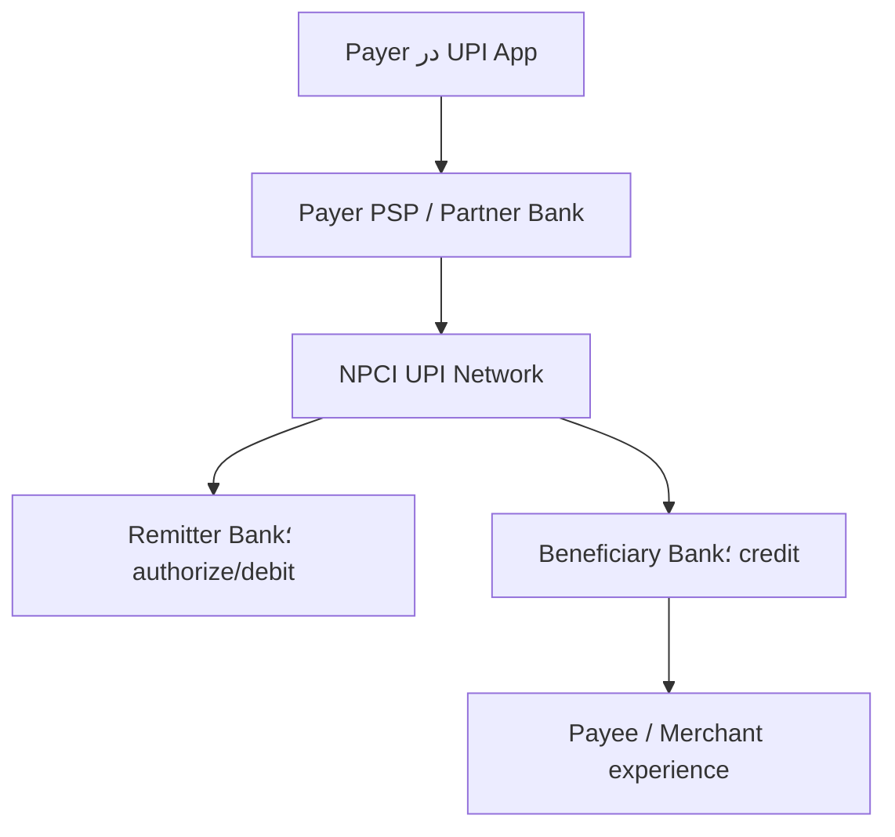

<!-- bidi: rtl; code: ltr -->
<div dir="rtl" align="right">

# پروندهٔ <span dir="ltr">Week 01</span> — <span dir="ltr">UPI</span> هند؛ از یک <span dir="ltr">Capability</span> تا شبکه‌ای با میلیاردها تراکنش

- <span dir="ltr">Case type:</span> زیرساخت پرداخت آنی و <span dir="ltr">interoperable</span>؛ **نه <span dir="ltr">Core Ledger</span> و نه یک <span dir="ltr">Mobile App</span> منفرد**
- <span dir="ltr">Relevance: Capability Map</span>، <span dir="ltr">System boundary</span>، نقش‌ها، <span dir="ltr">API Contract</span>، <span dir="ltr">Ownership</span> و <span dir="ltr">Failure amplification</span>
- <span dir="ltr">Evidence checked:</span> **<span dir="ltr">15 August 2026</span>**
- <span dir="ltr">Reading/analysis budget: 45 minutes</span>
- <span dir="ltr">Evidence rule: Fact</span>های جاری از <span dir="ltr">NPCI/RBI</span>؛ جزئیات <span dir="ltr">Runtime</span> غیرعمومی با <span dir="ltr">`UNKNOWN`</span>؛ <span dir="ltr">Domain map</span> این پرونده <span dir="ltr">`INFERENCE`</span> تحلیلی است.

## 1. چرا <span dir="ltr">UPI</span> برای <span dir="ltr">Week 01</span>؟

<span dir="ltr">UPI</span> یک آزمایش ذهنی عالی برای همان خطایی است که در <span dir="ltr">Week 01</span> می‌خواهیم حذف کنیم. در گفت‌وگوی روزمره ممکن است همهٔ این‌ها «<span dir="ltr">UPI</span>» نامیده شوند:

- توانایی پرداخت آنی از حساب بانکی
- شبکه و <span dir="ltr">Scheme</span> تحت راهبری <span dir="ltr">NPCI</span>
- <span dir="ltr">App</span>هایی مانند <span dir="ltr">BHIM</span> یا <span dir="ltr">Third-party app</span>
- <span dir="ltr">PSP Bank</span> و بانک صادرکننده/ذی‌نفع
- مجموعه‌ای از <span dir="ltr">API</span>ها، شناسه‌ها و قواعد عملیاتی
- <span dir="ltr">QR</span> روی میز فروشنده
- تجربهٔ مشتری و رسید پرداخت

اگر این سطح‌ها را یکی بگیریم، معماری غلط می‌شود. <span dir="ltr">App</span> مالک ماندهٔ سپرده نیست؛ <span dir="ltr">QR</span> خود <span dir="ltr">Payment System</span> نیست؛ <span dir="ltr">API</span> یک <span dir="ltr">Capability</span> نیست؛ و شبکهٔ <span dir="ltr">UPI</span> جای <span dir="ltr">Core Banking</span> بانک‌های عضو را نمی‌گیرد.

پرسش محوری پرونده:

> چگونه یک <span dir="ltr">Capability</span> عمومی با نقش‌ها و <span dir="ltr">Contract</span>های استاندارد به اکوسیستم بزرگی تبدیل شد، در حالی که <span dir="ltr">Authority</span> مانده و <span dir="ltr">Debit/Credit</span> نهایی در بانک‌های عضو باقی ماند؟

## 2. هویت و <span dir="ltr">Scope</span>

### <span dir="ltr">FACT</span> — <span dir="ltr">primary</span>

[<span dir="ltr">NPCI</span>](https://www.npci.org.in/) سازمان چتری زیرساخت‌های پرداخت خرد هند است و محصولاتی مانند <span dir="ltr">UPI</span>، <span dir="ltr">IMPS</span>، <span dir="ltr">RuPay</span>، <span dir="ltr">NACH</span> و <span dir="ltr">FASTag</span> را راهبری می‌کند. صفحهٔ رسمی <span dir="ltr">UPI</span> آن را سیستمی معرفی می‌کند که چند حساب بانکی/مجاز را در یک <span dir="ltr">App</span> قابل استفاده می‌کند و قابلیت‌هایی مانند انتقال وجه و پرداخت <span dir="ltr">Merchant</span> را در یک تجربهٔ مشترک می‌آورد.

### <span dir="ltr">Scope</span> این پرونده

در این <span dir="ltr">Week</span> بررسی می‌کنیم:

- تولد <span dir="ltr">UPI</span> و مسئله‌ای که حل کرد
- بازیگران و مرز مسئولیت عمومی
- تکامل <span dir="ltr">Capability</span>ها و <span dir="ltr">Product feature</span>ها
- <span dir="ltr">Contract</span> و <span dir="ltr">Flow</span> مفهومی <span dir="ltr">Push payment</span>
- <span dir="ltr">Failure</span>های عملیاتی و کنترل بار
- تفکیک <span dir="ltr">Fact</span>، <span dir="ltr">Inference</span> و <span dir="ltr">Unknown</span> در معماری فعلی

بررسی نمی‌کنیم:

- کد، دیتابیس یا <span dir="ltr">Topology</span> داخلی محرمانهٔ <span dir="ltr">NPCI</span>
- الگوریتم دقیق <span dir="ltr">Fraud detection</span> بانک‌ها
- تسویه و حسابداری کامل شبکه
- مقایسهٔ حقوقی <span dir="ltr">UPI</span> با شتاب/شتابک ایران

## 3. مسئله‌ای که باعث تولد شد

پیش از <span dir="ltr">UPI</span>، هند ابزارهایی مانند <span dir="ltr">NEFT</span>، <span dir="ltr">RTGS</span> و <span dir="ltr">IMPS</span> داشت. <span dir="ltr">IMPS</span> امکان انتقال آنی را ایجاد کرده بود، اما تجربهٔ پرداخت بین <span dir="ltr">App</span>ها، بانک‌ها، شناسه‌ها و <span dir="ltr">Merchant</span>ها هنوز یکپارچه نبود.

### مسئلهٔ <span dir="ltr">Capability</span>

کاربر باید بتواند:

- از <span dir="ltr">App</span> دلخواه به حساب بانکی خود دسترسی پرداختی داشته باشد.
- بدون افشای شماره حساب در هر تعامل، گیرنده را با شناسهٔ قابل‌استفاده پیدا کند.
- به فرد یا <span dir="ltr">Merchant</span> در شبکه‌ای <span dir="ltr">interoperable</span> پرداخت کند.
- نتیجه و شناسهٔ تراکنش را سریع دریافت کند.

بانک/شبکه باید بتواند:

- <span dir="ltr">Participant</span> را شناسایی و <span dir="ltr">Route</span> کند.
- <span dir="ltr">Authorization</span> و <span dir="ltr">Debit/Credit</span> را میان <span dir="ltr">Owner</span>های درست هماهنگ کند.
- وضعیت، <span dir="ltr">Failure</span>، <span dir="ltr">Reversal</span>، <span dir="ltr">Complaint</span> و <span dir="ltr">Reconciliation</span> را مدیریت کند.

<span dir="ltr">UPI</span> یک «اپ بهتر» نبود؛ یک مدل تعامل چندبازیگر و <span dir="ltr">Contract</span> مشترک بود.

## <span dir="ltr">4. Timeline</span>؛ از تولد تا وضعیت جاری

| زمان | رویداد | برچسب و معنای معماری |
|---|---|---|
| 2008 | ایجاد <span dir="ltr">NPCI</span> به‌عنوان سازمان چتری پرداخت خرد | <span dir="ltr">`FACT — primary`</span>؛ ایجاد <span dir="ltr">Operator</span> و <span dir="ltr">Governance</span> مشترک |
| 2010 | آغاز <span dir="ltr">IMPS</span> و تجربهٔ انتقال آنی بین‌بانکی | <span dir="ltr">`FACT — primary`</span>؛ پایهٔ عملیاتی مهم پیش از <span dir="ltr">UPI</span> |
| <span dir="ltr">11 Apr 2016</span> | <span dir="ltr">Pilot</span> رسمی <span dir="ltr">UPI</span> با حضور رئیس وقت <span dir="ltr">RBI</span> | <span dir="ltr">`FACT — primary`</span> از [<span dir="ltr">NPCI About UPI</span>](https://www.npci.org.in/product/upi/about-upi) |
| <span dir="ltr">Aug 2016</span> | آغاز عرضهٔ <span dir="ltr">App</span>های بانکی روی <span dir="ltr">UPI</span> | <span dir="ltr">`FACT — primary`</span>؛ جداسازی <span dir="ltr">Scheme/Network</span> از <span dir="ltr">App ecosystem</span> |
| 2018 | <span dir="ltr">UPI 2.0</span> و توسعهٔ <span dir="ltr">Use case</span>ها مانند <span dir="ltr">Mandate/Invoice</span> و امکانات پرداخت | <span dir="ltr">`FACT — primary`</span> در تاریخچهٔ <span dir="ltr">NPCI</span>؛ <span dir="ltr">Contract</span> تکامل یافت، <span dir="ltr">Capability</span> ثابت نماند |
| 2020 | <span dir="ltr">UPI AutoPay</span> برای <span dir="ltr">e-mandate</span> و پرداخت تکرارشونده | <span dir="ltr">`FACT — primary`</span> از [<span dir="ltr">NPCI AutoPay</span>](https://www.npci.org.in/product/autopay) |
| 2022 | <span dir="ltr">UPI 123PAY</span> برای <span dir="ltr">Feature phone</span> و <span dir="ltr">UPI Lite</span> برای پرداخت کم‌مبلغ | <span dir="ltr">`FACT — primary`</span> در اسناد <span dir="ltr">RBI/NPCI</span>؛ <span dir="ltr">Accessibility</span> و <span dir="ltr">Load isolation</span> به <span dir="ltr">Capability</span> تبدیل شد |
| <span dir="ltr">Sep 2023</span> | <span dir="ltr">UPI Lite X</span>، پرداخت <span dir="ltr">Conversational</span> و گسترش <span dir="ltr">Credit on UPI</span> | <span dir="ltr">`FACT — primary`</span> در [<span dir="ltr">NSFI 2025</span>–<span dir="ltr">30 RBI</span>](https://www.rbi.org.in/commonman/Upload/English/Content/PDFs/English12052026.pdf) |
| 2024 | <span dir="ltr">UPI Circle</span> برای تفویض مجوز پرداخت با <span dir="ltr">Limit</span> | <span dir="ltr">`FACT — primary`</span> از [<span dir="ltr">NPCI UPI Circle</span>](https://www.npci.org.in/product/upi-circle) |
| <span dir="ltr">Apr</span>–<span dir="ltr">May 2025</span> | چند اختلال گسترده و فشار ناشی از <span dir="ltr">Status check/</span>بار اکوسیستم | <span dir="ltr">`FACT — secondary`</span>؛ درس <span dir="ltr">Rate limit</span> و <span dir="ltr">Ecosystem ownership</span> |
| <span dir="ltr">Jul 2026</span> | 741 بانک <span dir="ltr">Live</span>، 23,658.35 میلیون تراکنش و ارزش 29,87,<span dir="ltr">880.49 crore</span> روپیه در یک ماه | <span dir="ltr">`FACT — primary`</span> از [<span dir="ltr">NPCI Product Statistics</span>](https://www.npci.org.in/product/upi/product-statistics)؛ <span dir="ltr">Current-state</span> در تاریخ کنترل |

<span dir="ltr">Timeline</span> نشان می‌دهد معماری فقط <span dir="ltr">Scale-out</span> زیرساخت نیست. هر مرحله بازیگر، <span dir="ltr">Rule</span>، <span dir="ltr">Failure mode</span> و <span dir="ltr">Contract</span> تازه‌ای اضافه کرده است.

## 5. تحول محصول و مدل اکوسیستم

### 5.1 از انتقال فردی به <span dir="ltr">Merchant platform</span>

<span dir="ltr">UPI</span> از <span dir="ltr">P2P</span> و انتقال حساب‌به‌حساب به <span dir="ltr">P2M</span>، <span dir="ltr">QR</span> ثابت/پویا، <span dir="ltr">Intent</span>، <span dir="ltr">Collect</span> و پرداخت داخل <span dir="ltr">App/Web</span> گسترش یافت. شبکهٔ مشترک اجازه داد <span dir="ltr">App</span> و <span dir="ltr">Merchant experience</span> رقابت کند، درحالی‌که <span dir="ltr">Contract</span> و <span dir="ltr">Participant rules</span> مشترک بماند.

### <span dir="ltr">5.2 AutoPay</span> و <span dir="ltr">Mandate</span>

پرداخت تکرارشونده دیگر یک <span dir="ltr">Transfer</span> ساده نیست. <span dir="ltr">Lifecycle</span> مجوز، <span dir="ltr">Limit</span>، <span dir="ltr">Revocation</span>، <span dir="ltr">Schedule</span> و <span dir="ltr">Failure retry</span> وارد مدل می‌شود. نتیجهٔ معماری: <span dir="ltr">`Payment`</span> واحدِ همه‌کاره کافی نیست؛ <span dir="ltr">Mandate capability</span> و <span dir="ltr">State</span> مستقل می‌خواهد.

### <span dir="ltr">5.3 UPI Lite</span> و <span dir="ltr">Lite X</span>

طبق سند <span dir="ltr">RBI</span>، <span dir="ltr">UPI Lite</span> برای پرداخت کم‌مبلغ طوری طراحی شده که هر تراکنش در لحظه به <span dir="ltr">Core Banking</span> بانک <span dir="ltr">Remitter</span> برخورد نکند؛ هدف کاهش بار <span dir="ltr">CBS</span> و افزایش <span dir="ltr">Success rate</span> است. <span dir="ltr">Lite X</span> قابلیت <span dir="ltr">Offline</span> را اضافه کرد.

درس مهم: بهینه‌سازی <span dir="ltr">Performance</span> فقط <span dir="ltr">Cache</span> فنی نیست؛ مدل <span dir="ltr">Authorisation</span>، <span dir="ltr">Risk</span>، <span dir="ltr">Limit</span> و <span dir="ltr">Reconciliation</span> را تغییر می‌دهد.

### <span dir="ltr">5.4 UPI 123PAY</span> و <span dir="ltr">Conversational payment</span>

گسترش به <span dir="ltr">Feature phone</span> و زبان/تعامل <span dir="ltr">Conversational</span> نشان داد <span dir="ltr">Capability</span> «دسترسی به پرداخت» از <span dir="ltr">Mobile App</span> هوشمند مستقل است. <span dir="ltr">Channel</span> تغییر کرد اما <span dir="ltr">Debit authority</span> و شبکهٔ پرداخت باقی ماند.

### <span dir="ltr">5.5 Credit Line on UPI</span>

[<span dir="ltr">Credit Line on UPI</span>](https://www.npci.org.in/product/upi/credit-line-on-upi) خط اعتباری از پیش مصوب بانک را برای پرداخت‌های کم‌مبلغ و پرتعداد در دسترس قرار می‌دهد. این ویژگی مرز <span dir="ltr">Payments</span> و <span dir="ltr">Lending</span> را به هم متصل می‌کند، اما یکی‌شدن <span dir="ltr">Ownership</span> آن‌ها را ثابت نمی‌کند.

### <span dir="ltr">5.6 UPI Circle</span>

[<span dir="ltr">UPI Circle</span>](https://www.npci.org.in/product/upi-circle) به <span dir="ltr">Payer</span> اجازه می‌دهد تحت <span dir="ltr">Limit</span> به فرد دیگری اختیار تراکنش بدهد. این تغییر کوچک <span dir="ltr">UX</span> نیست؛ <span dir="ltr">Delegation</span>، <span dir="ltr">Consent</span>، <span dir="ltr">Limit</span>، <span dir="ltr">Revocation</span> و <span dir="ltr">Audit trail</span> را به مدل اضافه می‌کند.

## 6. معماری عمومی و <span dir="ltr">Technology stack</span> فعلی

### 6.1 چیزهایی که می‌دانیم — <span dir="ltr">FACT</span>

<span dir="ltr">NPCI</span> بازیگران <span dir="ltr">UPI</span> را شامل <span dir="ltr">App</span>، <span dir="ltr">Payer PSP</span>، <span dir="ltr">Remitter Bank</span>، <span dir="ltr">Beneficiary Bank</span>، <span dir="ltr">Payee PSP</span> و خود <span dir="ltr">NPCI</span> معرفی می‌کند. فهرست رسمی اعضا نقش‌های <span dir="ltr">Issuer</span> و <span dir="ltr">PSP</span> را جدا نمایش می‌دهد.


</div>

<div dir="ltr" align="left">



</div>

<div dir="rtl" align="right">


این <span dir="ltr">Diagram</span> ترتیب <span dir="ltr">Protocol</span> قطعی همهٔ <span dir="ltr">Use case</span>ها نیست؛ نمای آموزشی <span dir="ltr">Push payment</span> است.

### <span dir="ltr">6.2 Flow</span> مفهومی <span dir="ltr">Push payment</span> — <span dir="ltr">FACT</span> + <span dir="ltr">simplification</span>

1. <span dir="ltr">Payer</span> در <span dir="ltr">App</span> گیرنده، مبلغ و حساب پرداخت را انتخاب می‌کند.
2. <span dir="ltr">App/PSP</span> درخواست را با شناسه و <span dir="ltr">Credential</span> لازم به شبکه می‌فرستد.
3. <span dir="ltr">UPI Participant</span> و مقصد را <span dir="ltr">Resolve/Route</span> می‌کند.
4. <span dir="ltr">Remitter Bank</span> احراز/مجوز و امکان <span dir="ltr">Debit</span> را بر اساس <span dir="ltr">Rule</span> خودش بررسی می‌کند.
5. <span dir="ltr">Beneficiary Bank Credit</span> را اعمال و نتیجه را برمی‌گرداند.
6. وضعیت و <span dir="ltr">Reference</span> به <span dir="ltr">Participant</span>ها و کاربر ابلاغ می‌شود.
7. موارد <span dir="ltr">Pending/Failed</span> نیازمند <span dir="ltr">status</span>، <span dir="ltr">reversal</span>، <span dir="ltr">complaint</span> و <span dir="ltr">reconciliation</span> هستند.

### <span dir="ltr">6.3 Ownership</span> عمومی

| <span dir="ltr">Fact/Decision</span> | <span dir="ltr">Authority</span> محتمل | برچسب |
|---|---|---|
| مانده و امکان <span dir="ltr">Debit</span> حساب <span dir="ltr">Payer</span> | <span dir="ltr">Remitter Bank/Core Banking</span> | <span dir="ltr">`FACT/strong inference`</span> از نقش بانک |
| ثبت <span dir="ltr">Credit</span> حساب گیرنده | <span dir="ltr">Beneficiary Bank</span> | <span dir="ltr">`FACT/strong inference`</span> |
| <span dir="ltr">Route</span> و <span dir="ltr">Scheme rules</span> | <span dir="ltr">NPCI/UPI network governance</span> | <span dir="ltr">`FACT`</span> |
| <span dir="ltr">App UX</span> و <span dir="ltr">initiation experience</span> | <span dir="ltr">PSP/TPAP</span> تحت قواعد <span dir="ltr">Scheme</span> | <span dir="ltr">`FACT`</span> |
| <span dir="ltr">UPI handle mapping</span> | <span dir="ltr">UPI ecosystem role</span>؛ جزئیات مالکیت پیاده‌سازی نیازمند <span dir="ltr">Spec</span> | <span dir="ltr">`UNKNOWN at implementation detail`</span> |
| <span dir="ltr">Fraud decision</span> نهایی | چندلایه میان <span dir="ltr">App</span>، <span dir="ltr">PSP</span>، بانک و شبکه | <span dir="ltr">`INFERENCE`</span>; جزئیات غیرعمومی |

### <span dir="ltr">6.4 Technology</span>هایی که می‌دانیم

- <span dir="ltr">Mobile/feature-phone/QR/Intent</span> و <span dir="ltr">API-based participant integration</span> به‌صورت عمومی مستندند.
- <span dir="ltr">UPI PIN</span> و سازوکارهای <span dir="ltr">Authentication/Authorisation</span> بخشی از تجربه و <span dir="ltr">Scheme</span> هستند.
- <span dir="ltr">Circular</span>ها قواعد <span dir="ltr">Operation</span>، <span dir="ltr">Limit</span>، <span dir="ltr">Branding</span>، <span dir="ltr">complaint</span> و تغییرات <span dir="ltr">Contract</span> را به <span dir="ltr">Participant</span>ها ابلاغ می‌کنند.
- <span dir="ltr">UPI Lite/Lite X</span> مسیرهای متفاوت برای پرداخت کم‌مبلغ و <span dir="ltr">Offline</span> دارند.

### 6.5 چیزهایی که عمداً <span dir="ltr">UNKNOWN</span> می‌مانند

منابع عمومی بررسی‌شده این موارد را با دقت <span dir="ltr">production-grade</span> افشا نمی‌کنند:

- زبان‌های برنامه‌نویسی و <span dir="ltr">Framework</span>های <span dir="ltr">Core UPI switch</span>
- نوع و <span dir="ltr">Topology</span> دیتابیس‌های داخلی
- تعداد <span dir="ltr">Service</span>ها یا اینکه <span dir="ltr">Microservice/Monolith</span> هستند
- <span dir="ltr">Cloud/on-prem split</span> و <span dir="ltr">Cluster topology</span>
- الگوریتم دقیق <span dir="ltr">Partitioning</span>، <span dir="ltr">Queueing</span> و <span dir="ltr">Failover</span>
- ظرفیت هر <span dir="ltr">Region</span> و <span dir="ltr">RPO/RTO</span> واقعی
- <span dir="ltr">Rule engine</span> و مدل <span dir="ltr">Fraud</span> داخلی

پس نوشتن «<span dir="ltr">UPI</span> حتماً <span dir="ltr">Kafka</span> + <span dir="ltr">Kubernetes</span> + <span dir="ltr">Microservices</span> دارد» **حدس** است و در این پرونده پذیرفته نیست.

## <span dir="ltr">7. Capability/Domain Map</span> تحلیلی

این <span dir="ltr">Map</span> بازسازی ساختار محرمانهٔ <span dir="ltr">NPCI</span> نیست؛ <span dir="ltr">`INFERENCE`</span> برای تمرین <span dir="ltr">Week 01</span> است.

| <span dir="ltr">Capability</span> | <span dir="ltr">Domain/Context hypothesis</span> | <span dir="ltr">Owner hypothesis</span> | <span dir="ltr">Evidence/uncertainty</span> |
|---|---|---|---|
| <span dir="ltr">Participant onboarding</span> & <span dir="ltr">certification</span> | <span dir="ltr">Scheme/Participant Management</span> | <span dir="ltr">NPCI</span> | نقش و <span dir="ltr">Member list</span> عمومی؛ مدل داخلی <span dir="ltr">Unknown</span> |
| <span dir="ltr">UPI identity/handle management</span> | <span dir="ltr">Addressing</span> & <span dir="ltr">Alias</span> | <span dir="ltr">PSP/NPCI ecosystem</span> | وجود <span dir="ltr">VPA Fact</span>؛ <span dir="ltr">Authority</span> دقیق وابسته به <span dir="ltr">Spec</span> |
| <span dir="ltr">Payment initiation</span> | <span dir="ltr">Payment Experience</span> | <span dir="ltr">App/PSP</span> | <span dir="ltr">Product flow</span> عمومی |
| <span dir="ltr">Authentication/authorisation</span> | <span dir="ltr">Payment Authorisation</span> | <span dir="ltr">Payer PSP</span> + <span dir="ltr">Remitter Bank</span> | نقش‌ها عمومی؛ <span dir="ltr">Control details</span> محرمانه |
| <span dir="ltr">Routing</span> | <span dir="ltr">Payment Network Switching</span> | <span dir="ltr">NPCI</span> | <span dir="ltr">Operator role</span> عمومی |
| <span dir="ltr">Account debit</span> | <span dir="ltr">Deposit/Core Banking</span> | <span dir="ltr">Remitter Bank</span> | <span dir="ltr">Bank balance authority</span> |
| <span dir="ltr">Account credit</span> | <span dir="ltr">Deposit/Core Banking</span> | <span dir="ltr">Beneficiary Bank</span> | <span dir="ltr">Bank posting authority</span> |
| <span dir="ltr">Transaction status</span> | <span dir="ltr">Network Transaction State</span> | <span dir="ltr">Shared contract with one authoritative state model needed</span> | دقیقاً محل <span dir="ltr">Authority</span> نیازمند <span dir="ltr">Spec</span> |
| <span dir="ltr">Mandate lifecycle</span> | <span dir="ltr">Mandate/AutoPay</span> | <span dir="ltr">Scheme</span> + <span dir="ltr">participant roles</span> | <span dir="ltr">AutoPay product evidence</span> |
| <span dir="ltr">Delegated payment</span> | <span dir="ltr">Delegation/Consent</span> | <span dir="ltr">Payer bank/PSP under UPI Circle</span> | <span dir="ltr">Product evidence</span>؛ <span dir="ltr">Context boundary inference</span> |
| <span dir="ltr">Dispute/complaint/chargeback</span> | <span dir="ltr">Dispute Management</span> | چندبازیگر با <span dir="ltr">Scheme rules</span> | <span dir="ltr">Complaint/circular evidence</span> |
| <span dir="ltr">Settlement</span> & <span dir="ltr">reconciliation</span> | <span dir="ltr">Clearing/Settlement</span> | <span dir="ltr">NPCI</span> + <span dir="ltr">member banks</span> | وجود عملیاتی قطعی؛ جزئیات خارج <span dir="ltr">Scope</span> |
| <span dir="ltr">Fraud/risk control</span> | <span dir="ltr">Risk</span> & <span dir="ltr">Fraud</span> | <span dir="ltr">Layered</span> | مدل و <span dir="ltr">Rule</span>ها <span dir="ltr">Unknown</span> |
| <span dir="ltr">Network operations</span> | <span dir="ltr">Platform Reliability</span> | <span dir="ltr">NPCI</span> + <span dir="ltr">Participant SRE</span> | <span dir="ltr">outage/circular evidence</span> |

نکتهٔ آموزشی: یک <span dir="ltr">Capability</span> مانند «پرداخت آنی» به چند <span dir="ltr">Context</span> و <span dir="ltr">Owner</span> می‌شکند. یک نام <span dir="ltr">Product</span> نمی‌تواند همه را در یک <span dir="ltr">`UpiService`</span> پنهان کند.

## 8. اشتباه‌ها، شکست‌ها و شرط‌بندی‌های پرهزینه

### <span dir="ltr">8.1 Outage</span> و <span dir="ltr">Retry amplification</span> در 2025

<span dir="ltr">`FACT — secondary`</span>: گزارش‌های عمومی دربارهٔ اختلال‌های <span dir="ltr">April</span> و <span dir="ltr">May 2025</span> نشان می‌دهند <span dir="ltr">UPI</span> در مقیاس ملی چند بار دچار افت/قطعی شد. یک گزارش دربارهٔ رخداد <span dir="ltr">12 April</span>، با استناد به بررسی <span dir="ltr">NPCI</span>، <span dir="ltr">Flood</span> شدن <span dir="ltr">`Check Transaction`</span> از سوی برخی <span dir="ltr">PSP Bank</span>ها را عامل فشار معرفی کرد؛ یعنی مکانیزمی که برای بازیابی وضعیت بود، خود به <span dir="ltr">Amplifier</span> بار تبدیل شد.

درس فنی:


</div>

<div dir="ltr" align="left">

```text
timeout
  → clients/participants check status aggressively
  → control-plane/read load rises
  → core path slows further
  → more timeout and more checks
```

</div>

<div dir="rtl" align="right">


<span dir="ltr">Retry</span> بدون <span dir="ltr">Backoff</span>، <span dir="ltr">Jitter</span>، <span dir="ltr">Rate limit</span>، <span dir="ltr">Idempotency</span> و <span dir="ltr">Load shedding</span> قابلیت اطمینان نیست؛ حلقهٔ بازخورد منفی است.

### <span dir="ltr">8.2 Governance</span> فقط در سند کافی نیست

<span dir="ltr">`INFERENCE`</span>: اگر <span dir="ltr">Limit</span> فراخوانی فقط به رعایت <span dir="ltr">Participant</span> وابسته باشد و <span dir="ltr">Enforcement</span> مرکزی یا <span dir="ltr">Capacity isolation</span> کافی نباشد، یک عضو می‌تواند روی کل اکوسیستم اثر بگذارد. این پرونده جزئیات <span dir="ltr">Control</span> فعلی را نمی‌داند، اما [<span dir="ltr">Circular</span>های <span dir="ltr">UPI</span>](https://www.npci.org.in/circulars/upi) نشان می‌دهند <span dir="ltr">Operation rules</span> به‌طور مستمر اصلاح می‌شوند.

### <span dir="ltr">8.3 Success rate</span> یک مسئلهٔ <span dir="ltr">End-to-end</span> است

<span dir="ltr">`INFERENCE`</span>: <span dir="ltr">UPI Network</span> ممکن است سالم باشد ولی <span dir="ltr">Core Banking</span> بانک فرستنده/گیرنده، <span dir="ltr">Middleware</span> یا <span dir="ltr">PSP</span> پاسخ ندهد. مالک تجربهٔ شکست از دید مشتری واحد است، اما <span dir="ltr">Root cause</span> و <span dir="ltr">Authority</span> توزیع شده‌اند. <span dir="ltr">SLO</span> باید <span dir="ltr">Dependency</span> و <span dir="ltr">Error attribution</span> داشته باشد.

### <span dir="ltr">8.4 Fraud</span> همیشه <span dir="ltr">Protocol breach</span> نیست

<span dir="ltr">`FACT — primary`</span>: [<span dir="ltr">NPCI Safety Shield</span>](https://www.npci.org.in/safety-feature) هشدار می‌دهد <span dir="ltr">UPI PIN</span> فقط برای کسر وجه وارد می‌شود. وجود این آموزش نشان می‌دهد <span dir="ltr">Social engineering</span> و ابهام جهت پرداخت یک <span dir="ltr">Failure mode</span> مهم اکوسیستم است.

درس معماری: <span dir="ltr">Security</span> فقط <span dir="ltr">Encryption</span> نیست؛ نام <span dir="ltr">Action</span>، <span dir="ltr">Confirmation screen</span>، نمایش گیرنده/مبلغ و تمایز <span dir="ltr">Receive</span> از <span dir="ltr">Pay</span> بخشی از <span dir="ltr">Control</span> هستند.

### <span dir="ltr">8.5 Concentration</span> و <span dir="ltr">Single logical network</span>

<span dir="ltr">`INFERENCE`</span>: موفقیت <span dir="ltr">UPI</span> وابستگی ملی به یک <span dir="ltr">Scheme/Network</span> منطقی را بالا برده است. این الزاماً «اشتباه» نیست؛ مزیت <span dir="ltr">interoperability</span> همین تمرکز <span dir="ltr">Contract</span> است. اما <span dir="ltr">Blast radius</span>، <span dir="ltr">DR</span>، <span dir="ltr">participant diversity</span> و <span dir="ltr">alternative rails</span> باید در <span dir="ltr">Governance</span> دیده شوند. جزئیات <span dir="ltr">Topology</span> داخلی برای قضاوت قطعی <span dir="ltr">`UNKNOWN`</span> است.

## 9. دستاوردهای جاری تا <span dir="ltr">15 August 2026</span>

### <span dir="ltr">Scale</span>

صفحهٔ رسمی آمار <span dir="ltr">NPCI</span> برای <span dir="ltr">July 2026</span> گزارش می‌کند:

- **741** بانک <span dir="ltr">Live</span>
- **23,<span dir="ltr">658.35 million</span>** تراکنش در ماه
- ارزش **29,87,<span dir="ltr">880.49 crore rupees</span>**

عددها را با واحد اصلی نگه داشته‌ایم تا خطای تبدیل رخ ندهد.

### <span dir="ltr">Capability expansion</span>

- <span dir="ltr">UPI Lite</span> برای کاهش فشار پرداخت‌های کم‌مبلغ بر <span dir="ltr">CBS</span>
- <span dir="ltr">Lite X</span> برای سناریوی <span dir="ltr">Offline</span>
- <span dir="ltr">123PAY</span> برای <span dir="ltr">Feature phone</span>
- <span dir="ltr">AutoPay</span> برای <span dir="ltr">Mandate</span> تکرارشونده
- <span dir="ltr">Credit Line on UPI</span> برای اتصال اعتبار مصوب به پرداخت
- <span dir="ltr">UPI Circle</span> برای <span dir="ltr">Delegated authorisation</span>
- <span dir="ltr">QR</span> و <span dir="ltr">Intent</span> برای <span dir="ltr">Interoperable merchant acceptance</span>

### <span dir="ltr">Authentication evolution</span>

صفحهٔ <span dir="ltr">Press Release</span> رسمی <span dir="ltr">NPCI</span> در 2026 از عبور تراکنش‌های <span dir="ltr">UPI</span> مبتنی بر <span dir="ltr">Biometric Authentication</span>، با احتساب <span dir="ltr">RuPay Credit Card on UPI</span>، از **<span dir="ltr">600 million</span> در <span dir="ltr">June 2026</span>** خبر می‌دهد. این دستاورد باید با <span dir="ltr">Scope</span> همان <span dir="ltr">Release</span> خوانده شود و به همهٔ <span dir="ltr">UPI</span> تعمیم داده نشود.

## 10. درس‌های قابل انتقال به <span dir="ltr">Core Banking Lab</span>

### قابل انتقال

1. **از <span dir="ltr">Capability</span> شروع کن:** مسئله پرداخت آنی بود، نه ساخت یک <span dir="ltr">App</span> یا <span dir="ltr">Microservice</span> خاص.
2. **<span dir="ltr">Role</span> و <span dir="ltr">Authority</span> را صریح کن:** <span dir="ltr">App</span>، <span dir="ltr">PSP</span>، <span dir="ltr">Network</span> و <span dir="ltr">Bank</span> مسئولیت یکسان ندارند.
3. **<span dir="ltr">Contract</span> استاندارد اکوسیستم می‌سازد:** <span dir="ltr">Interoperability</span> از <span dir="ltr">Contract</span> و <span dir="ltr">Governance</span> می‌آید، نه <span dir="ltr">Database</span> مشترک.
4. **<span dir="ltr">Core Ledger</span> را جابه‌جا نکن:** شبکه <span dir="ltr">Route/Coordinate</span> می‌کند؛ <span dir="ltr">Bank balance authority</span> باقی می‌ماند.
5. **<span dir="ltr">Status</span> یک <span dir="ltr">Capability</span> واقعی است:** <span dir="ltr">Pending</span>، <span dir="ltr">timeout</span>، <span dir="ltr">duplicate</span> و <span dir="ltr">reversal</span> باید مدل شوند.
6. **<span dir="ltr">Retry</span> را محدود کن:** <span dir="ltr">Recovery path</span> می‌تواند مسیر اصلی را نابود کند.
7. **<span dir="ltr">UX</span> بخشی از <span dir="ltr">Security</span> است:** جهت <span dir="ltr">Debit</span> و <span dir="ltr">Consent</span> باید آشکار باشد.
8. **<span dir="ltr">Fact/Inference/Unknown</span> را جدا کن:** <span dir="ltr">Scale</span> موفق مجوز حدس‌زدن <span dir="ltr">Tech stack</span> نیست.

### غیرقابل انتقال مستقیم

1. مقیاس، ساختار رگولاتوری و بازار هند با بانک واحد یا شبکهٔ ایران یکی نیست.
2. <span dir="ltr">Hub</span> مرکزی <span dir="ltr">UPI</span> دلیل کافی برای ساخت <span dir="ltr">Orchestrator</span> مرکزی همه‌چیزدان در <span dir="ltr">Core Banking</span> نیست.
3. تعداد <span dir="ltr">Transaction</span>ها دلیل انتخاب <span dir="ltr">Microservice</span> یا <span dir="ltr">Kafka</span> خاص نیست.
4. مدل <span dir="ltr">Participant</span> و <span dir="ltr">Settlement</span> بدون اسناد حقوقی/عملیاتی محلی <span dir="ltr">Copy</span> نمی‌شود.
5. <span dir="ltr">UPI</span> جایگزین <span dir="ltr">Deposits</span>، <span dir="ltr">Lending</span> یا <span dir="ltr">Accounting</span> داخلی بانک نیست.

## <span dir="ltr">11. Artifact 45</span> دقیقه‌ای و پنج سؤال دفاعی

### بودجه

- 15 دقیقه: <span dir="ltr">Timeline</span> و <span dir="ltr">Sections 3</span> تا 5
- 12 دقیقه: معماری و <span dir="ltr">Ownership</span> در <span dir="ltr">Section 6</span>
- 10 دقیقه: <span dir="ltr">Failure</span> و درس‌ها
- 8 دقیقه: <span dir="ltr">Artifact</span> و دفاع

### <span dir="ltr">Artifact</span>

[<span dir="ltr">Day 09 Exercise</span>](../exercises/day-09-upi-capability-contract-review.md) را انجام بده:

1. پنج <span dir="ltr">Fact</span>، سه <span dir="ltr">Inference</span> و سه <span dir="ltr">Unknown</span> استخراج کن.
2. زنجیرهٔ <span dir="ltr">`Instant Payment Capability → Push Payment Contract`</span> را بساز.
3. <span dir="ltr">Owner</span> مانده، <span dir="ltr">Route</span>، <span dir="ltr">App experience</span>، <span dir="ltr">Network status</span> و <span dir="ltr">Complaint</span> را تفکیک کن.
4. حلقهٔ <span dir="ltr">Retry amplification</span> سال 2025 را در چهار گام توضیح بده.
5. <span dir="ltr">ADR-lite</span> بنویس: «آیا <span dir="ltr">Core Banking Lab</span> باید <span dir="ltr">UPI-like hub</span> بسازد؟»

### پرسش‌های دفاعی

1. چرا <span dir="ltr">Google Pay/BHIM</span> یا <span dir="ltr">QR</span> خود <span dir="ltr">UPI System</span> نیست؟
2. چرا <span dir="ltr">NPCI</span> مالک ماندهٔ سپردهٔ مشتری فرض نمی‌شود؟
3. کدام بخش <span dir="ltr">Flow</span> <span dir="ltr">`FACT`</span> و کدام بخش <span dir="ltr">Simplification</span> تحلیلی است؟
4. چگونه <span dir="ltr">Check-status</span> می‌تواند <span dir="ltr">Availability</span> را بدتر کند؟
5. کدام تصمیم <span dir="ltr">UPI</span> برای <span dir="ltr">Lab</span> ما مفید است ولی نباید عیناً <span dir="ltr">Copy</span> شود؟

## <span dir="ltr">12. Source Register</span>

| منبع | نوع | استفاده |
|---|---|---|
| [<span dir="ltr">NPCI</span> — <span dir="ltr">About UPI</span>](https://www.npci.org.in/product/upi/about-upi) | <span dir="ltr">`FACT — primary`</span> | تعریف، <span dir="ltr">Pilot 2016</span>، <span dir="ltr">Participants</span> و قابلیت‌ها |
| [<span dir="ltr">NPCI</span> — <span dir="ltr">UPI Product Statistics</span>](https://www.npci.org.in/product/upi/product-statistics) | <span dir="ltr">`FACT — primary`</span> | آمار ماهانه تا <span dir="ltr">July 2026</span> |
| [<span dir="ltr">NPCI</span> — <span dir="ltr">UPI Live Members</span>](https://www.npci.org.in/product/upi/all-members) | <span dir="ltr">`FACT — primary`</span> | نقش و تعداد <span dir="ltr">Participant</span>ها |
| [<span dir="ltr">NPCI</span> — <span dir="ltr">UPI Circulars</span>](https://www.npci.org.in/circulars/upi) | <span dir="ltr">`FACT — primary`</span> | تغییرات عملیاتی، <span dir="ltr">Limit</span> و <span dir="ltr">Governance</span> |
| [<span dir="ltr">NPCI</span> — <span dir="ltr">AutoPay</span>](https://www.npci.org.in/product/autopay) | <span dir="ltr">`FACT — primary`</span> | <span dir="ltr">Mandate</span> و پرداخت تکرارشونده |
| [<span dir="ltr">NPCI</span> — <span dir="ltr">UPI Lite</span>](https://www.npci.org.in/product/upi/upi-lite) | <span dir="ltr">`FACT — primary`</span> | پرداخت کم‌مبلغ |
| [<span dir="ltr">NPCI</span> — <span dir="ltr">Credit Line on UPI</span>](https://www.npci.org.in/product/upi/credit-line-on-upi) | <span dir="ltr">`FACT — primary`</span> | اتصال اعتبار مصوب به پرداخت |
| [<span dir="ltr">NPCI</span> — <span dir="ltr">UPI Circle</span>](https://www.npci.org.in/product/upi-circle) | <span dir="ltr">`FACT — primary`</span> | <span dir="ltr">Delegation</span> و <span dir="ltr">Limit</span> |
| [<span dir="ltr">NPCI</span> — <span dir="ltr">Safety Shield</span>](https://www.npci.org.in/safety-feature) | <span dir="ltr">`FACT — primary`</span> | <span dir="ltr">Fraud awareness</span> و معنای <span dir="ltr">UPI PIN</span> |
| [<span dir="ltr">NPCI</span> — <span dir="ltr">Press Releases</span>](https://www.npci.org.in/media/press-release) | <span dir="ltr">`FACT — primary`</span> | دستاوردهای جاری 2026 |
| [<span dir="ltr">RBI</span> — <span dir="ltr">National Strategy for Financial Inclusion 2025</span>–30](https://www.rbi.org.in/commonman/Upload/English/Content/PDFs/English12052026.pdf) | <span dir="ltr">`FACT — primary`</span> | <span dir="ltr">Lite</span>، <span dir="ltr">Lite X</span>، <span dir="ltr">CBS load</span> و <span dir="ltr">Financial inclusion</span> |
| [<span dir="ltr">ORF</span> — <span dir="ltr">UPI at Scale: Outages and Resilient Systems</span>](https://www.orfonline.org/expert-speak/upi-at-scale-outages-and-the-push-for-resilient-systems) | <span dir="ltr">`FACT — secondary`</span> | جمع‌بندی <span dir="ltr">Outage</span>های 2025 و <span dir="ltr">Resilience</span> |
| [<span dir="ltr">Times of India</span> — <span dir="ltr">April 2025 outage RCA report</span>](https://timesofindia.indiatimes.com/technology/tech-news/npci-reveals-the-reason-behind-the-longest-upi-outage-the-issue-was-caused-by-/articleshow/120342808.cms) | <span dir="ltr">`FACT — secondary`</span> | <span dir="ltr">Check-transaction flood</span>؛ منبع اصلی <span dir="ltr">RCA</span> عمومی مستقیم یافت نشد |

## حکم نهایی پرونده

<span dir="ltr">UPI</span> نشان می‌دهد یک معماری بانکی موفق می‌تواند **<span dir="ltr">Contract</span> و <span dir="ltr">Governance</span> را متمرکز و تجربهٔ محصول را توزیع** کند، بدون اینکه همهٔ داده و منطق بانکی را در یک <span dir="ltr">Application</span> ادغام کند. همان موفقیت، <span dir="ltr">Blast radius</span> و مسئولیت <span dir="ltr">End-to-end</span> بزرگی ایجاد می‌کند. درس <span dir="ltr">Week 01</span> این نیست که <span dir="ltr">UPI</span> را <span dir="ltr">Copy</span> کنیم؛ این است که <span dir="ltr">Capability</span>، <span dir="ltr">System</span>، <span dir="ltr">Actor</span>، <span dir="ltr">Authority</span> و <span dir="ltr">Contract</span> را با هم اشتباه نگیریم.


</div>
