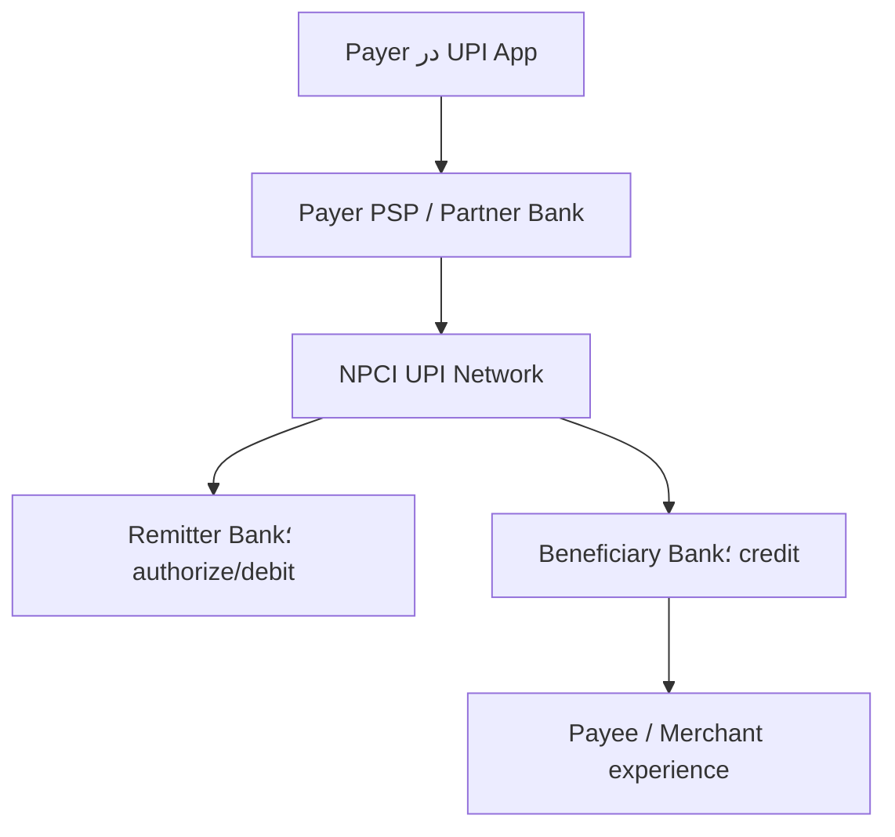

# پروندهٔ Week 01 — UPI هند؛ از یک Capability تا شبکه‌ای با میلیاردها تراکنش

- Case type: زیرساخت پرداخت آنی و interoperable؛ **نه Core Ledger و نه یک Mobile App منفرد**
- Relevance: Capability Map، System boundary، نقش‌ها، API Contract، Ownership و Failure amplification
- Evidence checked: **15 August 2026**
- Reading/analysis budget: 45 minutes
- Evidence rule: Factهای جاری از NPCI/RBI؛ جزئیات Runtime غیرعمومی با `UNKNOWN`؛ Domain map این پرونده `INFERENCE` تحلیلی است.

## 1. چرا UPI برای Week 01؟

UPI یک آزمایش ذهنی عالی برای همان خطایی است که در Week 01 می‌خواهیم حذف کنیم. در گفت‌وگوی روزمره ممکن است همهٔ این‌ها «UPI» نامیده شوند:

- توانایی پرداخت آنی از حساب بانکی
- شبکه و Scheme تحت راهبری NPCI
- Appهایی مانند BHIM یا Third-party app
- PSP Bank و بانک صادرکننده/ذی‌نفع
- مجموعه‌ای از APIها، شناسه‌ها و قواعد عملیاتی
- QR روی میز فروشنده
- تجربهٔ مشتری و رسید پرداخت

اگر این سطح‌ها را یکی بگیریم، معماری غلط می‌شود. App مالک ماندهٔ سپرده نیست؛ QR خود Payment System نیست؛ API یک Capability نیست؛ و شبکهٔ UPI جای Core Banking بانک‌های عضو را نمی‌گیرد.

پرسش محوری پرونده:

> چگونه یک Capability عمومی با نقش‌ها و Contractهای استاندارد به اکوسیستم بزرگی تبدیل شد، در حالی که Authority مانده و Debit/Credit نهایی در بانک‌های عضو باقی ماند؟

## 2. هویت و Scope

### FACT — primary

[NPCI](https://www.npci.org.in/) سازمان چتری زیرساخت‌های پرداخت خرد هند است و محصولاتی مانند UPI، IMPS، RuPay، NACH و FASTag را راهبری می‌کند. صفحهٔ رسمی UPI آن را سیستمی معرفی می‌کند که چند حساب بانکی/مجاز را در یک App قابل استفاده می‌کند و قابلیت‌هایی مانند انتقال وجه و پرداخت Merchant را در یک تجربهٔ مشترک می‌آورد.

### Scope این پرونده

در این Week بررسی می‌کنیم:

- تولد UPI و مسئله‌ای که حل کرد
- بازیگران و مرز مسئولیت عمومی
- تکامل Capabilityها و Product featureها
- Contract و Flow مفهومی Push payment
- Failureهای عملیاتی و کنترل بار
- تفکیک Fact، Inference و Unknown در معماری فعلی

بررسی نمی‌کنیم:

- کد، دیتابیس یا Topology داخلی محرمانهٔ NPCI
- الگوریتم دقیق Fraud detection بانک‌ها
- تسویه و حسابداری کامل شبکه
- مقایسهٔ حقوقی UPI با شتاب/شتابک ایران

## 3. مسئله‌ای که باعث تولد شد

پیش از UPI، هند ابزارهایی مانند NEFT، RTGS و IMPS داشت. IMPS امکان انتقال آنی را ایجاد کرده بود، اما تجربهٔ پرداخت بین Appها، بانک‌ها، شناسه‌ها و Merchantها هنوز یکپارچه نبود.

### مسئلهٔ Capability

کاربر باید بتواند:

- از App دلخواه به حساب بانکی خود دسترسی پرداختی داشته باشد.
- بدون افشای شماره حساب در هر تعامل، گیرنده را با شناسهٔ قابل‌استفاده پیدا کند.
- به فرد یا Merchant در شبکه‌ای interoperable پرداخت کند.
- نتیجه و شناسهٔ تراکنش را سریع دریافت کند.

بانک/شبکه باید بتواند:

- Participant را شناسایی و Route کند.
- Authorization و Debit/Credit را میان Ownerهای درست هماهنگ کند.
- وضعیت، Failure، Reversal، Complaint و Reconciliation را مدیریت کند.

UPI یک «اپ بهتر» نبود؛ یک مدل تعامل چندبازیگر و Contract مشترک بود.

## 4. Timeline؛ از تولد تا وضعیت جاری

| زمان | رویداد | برچسب و معنای معماری |
|---|---|---|
| 2008 | ایجاد NPCI به‌عنوان سازمان چتری پرداخت خرد | `FACT — primary`؛ ایجاد Operator و Governance مشترک |
| 2010 | آغاز IMPS و تجربهٔ انتقال آنی بین‌بانکی | `FACT — primary`؛ پایهٔ عملیاتی مهم پیش از UPI |
| 11 Apr 2016 | Pilot رسمی UPI با حضور رئیس وقت RBI | `FACT — primary` از [NPCI About UPI](https://www.npci.org.in/product/upi/about-upi) |
| Aug 2016 | آغاز عرضهٔ Appهای بانکی روی UPI | `FACT — primary`؛ جداسازی Scheme/Network از App ecosystem |
| 2018 | UPI 2.0 و توسعهٔ Use caseها مانند Mandate/Invoice و امکانات پرداخت | `FACT — primary` در تاریخچهٔ NPCI؛ Contract تکامل یافت، Capability ثابت نماند |
| 2020 | UPI AutoPay برای e-mandate و پرداخت تکرارشونده | `FACT — primary` از [NPCI AutoPay](https://www.npci.org.in/product/autopay) |
| 2022 | UPI 123PAY برای Feature phone و UPI Lite برای پرداخت کم‌مبلغ | `FACT — primary` در اسناد RBI/NPCI؛ Accessibility و Load isolation به Capability تبدیل شد |
| Sep 2023 | UPI Lite X، پرداخت Conversational و گسترش Credit on UPI | `FACT — primary` در [NSFI 2025–30 RBI](https://www.rbi.org.in/commonman/Upload/English/Content/PDFs/English12052026.pdf) |
| 2024 | UPI Circle برای تفویض مجوز پرداخت با Limit | `FACT — primary` از [NPCI UPI Circle](https://www.npci.org.in/product/upi-circle) |
| Apr–May 2025 | چند اختلال گسترده و فشار ناشی از Status check/بار اکوسیستم | `FACT — secondary`؛ درس Rate limit و Ecosystem ownership |
| Jul 2026 | 741 بانک Live، 23,658.35 میلیون تراکنش و ارزش 29,87,880.49 crore روپیه در یک ماه | `FACT — primary` از [NPCI Product Statistics](https://www.npci.org.in/product/upi/product-statistics)؛ Current-state در تاریخ کنترل |

Timeline نشان می‌دهد معماری فقط Scale-out زیرساخت نیست. هر مرحله بازیگر، Rule، Failure mode و Contract تازه‌ای اضافه کرده است.

## 5. تحول محصول و مدل اکوسیستم

### 5.1 از انتقال فردی به Merchant platform

UPI از P2P و انتقال حساب‌به‌حساب به P2M، QR ثابت/پویا، Intent، Collect و پرداخت داخل App/Web گسترش یافت. شبکهٔ مشترک اجازه داد App و Merchant experience رقابت کند، درحالی‌که Contract و Participant rules مشترک بماند.

### 5.2 AutoPay و Mandate

پرداخت تکرارشونده دیگر یک Transfer ساده نیست. Lifecycle مجوز، Limit، Revocation، Schedule و Failure retry وارد مدل می‌شود. نتیجهٔ معماری: `Payment` واحدِ همه‌کاره کافی نیست؛ Mandate capability و State مستقل می‌خواهد.

### 5.3 UPI Lite و Lite X

طبق سند RBI، UPI Lite برای پرداخت کم‌مبلغ طوری طراحی شده که هر تراکنش در لحظه به Core Banking بانک Remitter برخورد نکند؛ هدف کاهش بار CBS و افزایش Success rate است. Lite X قابلیت Offline را اضافه کرد.

درس مهم: بهینه‌سازی Performance فقط Cache فنی نیست؛ مدل Authorisation، Risk، Limit و Reconciliation را تغییر می‌دهد.

### 5.4 UPI 123PAY و Conversational payment

گسترش به Feature phone و زبان/تعامل Conversational نشان داد Capability «دسترسی به پرداخت» از Mobile App هوشمند مستقل است. Channel تغییر کرد اما Debit authority و شبکهٔ پرداخت باقی ماند.

### 5.5 Credit Line on UPI

[Credit Line on UPI](https://www.npci.org.in/product/upi/credit-line-on-upi) خط اعتباری از پیش مصوب بانک را برای پرداخت‌های کم‌مبلغ و پرتعداد در دسترس قرار می‌دهد. این ویژگی مرز Payments و Lending را به هم متصل می‌کند، اما یکی‌شدن Ownership آن‌ها را ثابت نمی‌کند.

### 5.6 UPI Circle

[UPI Circle](https://www.npci.org.in/product/upi-circle) به Payer اجازه می‌دهد تحت Limit به فرد دیگری اختیار تراکنش بدهد. این تغییر کوچک UX نیست؛ Delegation، Consent، Limit، Revocation و Audit trail را به مدل اضافه می‌کند.

## 6. معماری عمومی و Technology stack فعلی

### 6.1 چیزهایی که می‌دانیم — FACT

NPCI بازیگران UPI را شامل App، Payer PSP، Remitter Bank، Beneficiary Bank، Payee PSP و خود NPCI معرفی می‌کند. فهرست رسمی اعضا نقش‌های Issuer و PSP را جدا نمایش می‌دهد.



این Diagram ترتیب Protocol قطعی همهٔ Use caseها نیست؛ نمای آموزشی Push payment است.

### 6.2 Flow مفهومی Push payment — FACT + simplification

1. Payer در App گیرنده، مبلغ و حساب پرداخت را انتخاب می‌کند.
2. App/PSP درخواست را با شناسه و Credential لازم به شبکه می‌فرستد.
3. UPI Participant و مقصد را Resolve/Route می‌کند.
4. Remitter Bank احراز/مجوز و امکان Debit را بر اساس Rule خودش بررسی می‌کند.
5. Beneficiary Bank Credit را اعمال و نتیجه را برمی‌گرداند.
6. وضعیت و Reference به Participantها و کاربر ابلاغ می‌شود.
7. موارد Pending/Failed نیازمند status، reversal، complaint و reconciliation هستند.

### 6.3 Ownership عمومی

| Fact/Decision | Authority محتمل | برچسب |
|---|---|---|
| مانده و امکان Debit حساب Payer | Remitter Bank/Core Banking | `FACT/strong inference` از نقش بانک |
| ثبت Credit حساب گیرنده | Beneficiary Bank | `FACT/strong inference` |
| Route و Scheme rules | NPCI/UPI network governance | `FACT` |
| App UX و initiation experience | PSP/TPAP تحت قواعد Scheme | `FACT` |
| UPI handle mapping | UPI ecosystem role؛ جزئیات مالکیت پیاده‌سازی نیازمند Spec | `UNKNOWN at implementation detail` |
| Fraud decision نهایی | چندلایه میان App، PSP، بانک و شبکه | `INFERENCE`; جزئیات غیرعمومی |

### 6.4 Technologyهایی که می‌دانیم

- Mobile/feature-phone/QR/Intent و API-based participant integration به‌صورت عمومی مستندند.
- UPI PIN و سازوکارهای Authentication/Authorisation بخشی از تجربه و Scheme هستند.
- Circularها قواعد Operation، Limit، Branding، complaint و تغییرات Contract را به Participantها ابلاغ می‌کنند.
- UPI Lite/Lite X مسیرهای متفاوت برای پرداخت کم‌مبلغ و Offline دارند.

### 6.5 چیزهایی که عمداً UNKNOWN می‌مانند

منابع عمومی بررسی‌شده این موارد را با دقت production-grade افشا نمی‌کنند:

- زبان‌های برنامه‌نویسی و Frameworkهای Core UPI switch
- نوع و Topology دیتابیس‌های داخلی
- تعداد Serviceها یا اینکه Microservice/Monolith هستند
- Cloud/on-prem split و Cluster topology
- الگوریتم دقیق Partitioning، Queueing و Failover
- ظرفیت هر Region و RPO/RTO واقعی
- Rule engine و مدل Fraud داخلی

پس نوشتن «UPI حتماً Kafka + Kubernetes + Microservices دارد» **حدس** است و در این پرونده پذیرفته نیست.

## 7. Capability/Domain Map تحلیلی

این Map بازسازی ساختار محرمانهٔ NPCI نیست؛ `INFERENCE` برای تمرین Week 01 است.

| Capability | Domain/Context hypothesis | Owner hypothesis | Evidence/uncertainty |
|---|---|---|---|
| Participant onboarding & certification | Scheme/Participant Management | NPCI | نقش و Member list عمومی؛ مدل داخلی Unknown |
| UPI identity/handle management | Addressing & Alias | PSP/NPCI ecosystem | وجود VPA Fact؛ Authority دقیق وابسته به Spec |
| Payment initiation | Payment Experience | App/PSP | Product flow عمومی |
| Authentication/authorisation | Payment Authorisation | Payer PSP + Remitter Bank | نقش‌ها عمومی؛ Control details محرمانه |
| Routing | Payment Network Switching | NPCI | Operator role عمومی |
| Account debit | Deposit/Core Banking | Remitter Bank | Bank balance authority |
| Account credit | Deposit/Core Banking | Beneficiary Bank | Bank posting authority |
| Transaction status | Network Transaction State | Shared contract with one authoritative state model needed | دقیقاً محل Authority نیازمند Spec |
| Mandate lifecycle | Mandate/AutoPay | Scheme + participant roles | AutoPay product evidence |
| Delegated payment | Delegation/Consent | Payer bank/PSP under UPI Circle | Product evidence؛ Context boundary inference |
| Dispute/complaint/chargeback | Dispute Management | چندبازیگر با Scheme rules | Complaint/circular evidence |
| Settlement & reconciliation | Clearing/Settlement | NPCI + member banks | وجود عملیاتی قطعی؛ جزئیات خارج Scope |
| Fraud/risk control | Risk & Fraud | Layered | مدل و Ruleها Unknown |
| Network operations | Platform Reliability | NPCI + Participant SRE | outage/circular evidence |

نکتهٔ آموزشی: یک Capability مانند «پرداخت آنی» به چند Context و Owner می‌شکند. یک نام Product نمی‌تواند همه را در یک `UpiService` پنهان کند.

## 8. اشتباه‌ها، شکست‌ها و شرط‌بندی‌های پرهزینه

### 8.1 Outage و Retry amplification در 2025

`FACT — secondary`: گزارش‌های عمومی دربارهٔ اختلال‌های April و May 2025 نشان می‌دهند UPI در مقیاس ملی چند بار دچار افت/قطعی شد. یک گزارش دربارهٔ رخداد 12 April، با استناد به بررسی NPCI، Flood شدن `Check Transaction` از سوی برخی PSP Bankها را عامل فشار معرفی کرد؛ یعنی مکانیزمی که برای بازیابی وضعیت بود، خود به Amplifier بار تبدیل شد.

درس فنی:

```text
timeout
  → clients/participants check status aggressively
  → control-plane/read load rises
  → core path slows further
  → more timeout and more checks
```

Retry بدون Backoff، Jitter، Rate limit، Idempotency و Load shedding قابلیت اطمینان نیست؛ حلقهٔ بازخورد منفی است.

### 8.2 Governance فقط در سند کافی نیست

`INFERENCE`: اگر Limit فراخوانی فقط به رعایت Participant وابسته باشد و Enforcement مرکزی یا Capacity isolation کافی نباشد، یک عضو می‌تواند روی کل اکوسیستم اثر بگذارد. این پرونده جزئیات Control فعلی را نمی‌داند، اما [Circularهای UPI](https://www.npci.org.in/circulars/upi) نشان می‌دهند Operation rules به‌طور مستمر اصلاح می‌شوند.

### 8.3 Success rate یک مسئلهٔ End-to-end است

`INFERENCE`: UPI Network ممکن است سالم باشد ولی Core Banking بانک فرستنده/گیرنده، Middleware یا PSP پاسخ ندهد. مالک تجربهٔ شکست از دید مشتری واحد است، اما Root cause و Authority توزیع شده‌اند. SLO باید Dependency و Error attribution داشته باشد.

### 8.4 Fraud همیشه Protocol breach نیست

`FACT — primary`: [NPCI Safety Shield](https://www.npci.org.in/safety-feature) هشدار می‌دهد UPI PIN فقط برای کسر وجه وارد می‌شود. وجود این آموزش نشان می‌دهد Social engineering و ابهام جهت پرداخت یک Failure mode مهم اکوسیستم است.

درس معماری: Security فقط Encryption نیست؛ نام Action، Confirmation screen، نمایش گیرنده/مبلغ و تمایز Receive از Pay بخشی از Control هستند.

### 8.5 Concentration و Single logical network

`INFERENCE`: موفقیت UPI وابستگی ملی به یک Scheme/Network منطقی را بالا برده است. این الزاماً «اشتباه» نیست؛ مزیت interoperability همین تمرکز Contract است. اما Blast radius، DR، participant diversity و alternative rails باید در Governance دیده شوند. جزئیات Topology داخلی برای قضاوت قطعی `UNKNOWN` است.

## 9. دستاوردهای جاری تا 15 August 2026

### Scale

صفحهٔ رسمی آمار NPCI برای July 2026 گزارش می‌کند:

- **741** بانک Live
- **23,658.35 million** تراکنش در ماه
- ارزش **29,87,880.49 crore rupees**

عددها را با واحد اصلی نگه داشته‌ایم تا خطای تبدیل رخ ندهد.

### Capability expansion

- UPI Lite برای کاهش فشار پرداخت‌های کم‌مبلغ بر CBS
- Lite X برای سناریوی Offline
- 123PAY برای Feature phone
- AutoPay برای Mandate تکرارشونده
- Credit Line on UPI برای اتصال اعتبار مصوب به پرداخت
- UPI Circle برای Delegated authorisation
- QR و Intent برای Interoperable merchant acceptance

### Authentication evolution

صفحهٔ Press Release رسمی NPCI در 2026 از عبور تراکنش‌های UPI مبتنی بر Biometric Authentication، با احتساب RuPay Credit Card on UPI، از **600 million در June 2026** خبر می‌دهد. این دستاورد باید با Scope همان Release خوانده شود و به همهٔ UPI تعمیم داده نشود.

## 10. درس‌های قابل انتقال به Core Banking Lab

### قابل انتقال

1. **از Capability شروع کن:** مسئله پرداخت آنی بود، نه ساخت یک App یا Microservice خاص.
2. **Role و Authority را صریح کن:** App، PSP، Network و Bank مسئولیت یکسان ندارند.
3. **Contract استاندارد اکوسیستم می‌سازد:** Interoperability از Contract و Governance می‌آید، نه Database مشترک.
4. **Core Ledger را جابه‌جا نکن:** شبکه Route/Coordinate می‌کند؛ Bank balance authority باقی می‌ماند.
5. **Status یک Capability واقعی است:** Pending، timeout، duplicate و reversal باید مدل شوند.
6. **Retry را محدود کن:** Recovery path می‌تواند مسیر اصلی را نابود کند.
7. **UX بخشی از Security است:** جهت Debit و Consent باید آشکار باشد.
8. **Fact/Inference/Unknown را جدا کن:** Scale موفق مجوز حدس‌زدن Tech stack نیست.

### غیرقابل انتقال مستقیم

1. مقیاس، ساختار رگولاتوری و بازار هند با بانک واحد یا شبکهٔ ایران یکی نیست.
2. Hub مرکزی UPI دلیل کافی برای ساخت Orchestrator مرکزی همه‌چیزدان در Core Banking نیست.
3. تعداد Transactionها دلیل انتخاب Microservice یا Kafka خاص نیست.
4. مدل Participant و Settlement بدون اسناد حقوقی/عملیاتی محلی Copy نمی‌شود.
5. UPI جایگزین Deposits، Lending یا Accounting داخلی بانک نیست.

## 11. Artifact 45 دقیقه‌ای و پنج سؤال دفاعی

### بودجه

- 15 دقیقه: Timeline و Sections 3 تا 5
- 12 دقیقه: معماری و Ownership در Section 6
- 10 دقیقه: Failure و درس‌ها
- 8 دقیقه: Artifact و دفاع

### Artifact

[Day 09 Exercise](../exercises/day-09-upi-capability-contract-review.md) را انجام بده:

1. پنج Fact، سه Inference و سه Unknown استخراج کن.
2. زنجیرهٔ `Instant Payment Capability → Push Payment Contract` را بساز.
3. Owner مانده، Route، App experience، Network status و Complaint را تفکیک کن.
4. حلقهٔ Retry amplification سال 2025 را در چهار گام توضیح بده.
5. ADR-lite بنویس: «آیا Core Banking Lab باید UPI-like hub بسازد؟»

### پرسش‌های دفاعی

1. چرا Google Pay/BHIM یا QR خود UPI System نیست؟
2. چرا NPCI مالک ماندهٔ سپردهٔ مشتری فرض نمی‌شود؟
3. کدام بخش Flow `FACT` و کدام بخش Simplification تحلیلی است؟
4. چگونه Check-status می‌تواند Availability را بدتر کند؟
5. کدام تصمیم UPI برای Lab ما مفید است ولی نباید عیناً Copy شود؟

## 12. Source Register

| منبع | نوع | استفاده |
|---|---|---|
| [NPCI — About UPI](https://www.npci.org.in/product/upi/about-upi) | `FACT — primary` | تعریف، Pilot 2016، Participants و قابلیت‌ها |
| [NPCI — UPI Product Statistics](https://www.npci.org.in/product/upi/product-statistics) | `FACT — primary` | آمار ماهانه تا July 2026 |
| [NPCI — UPI Live Members](https://www.npci.org.in/product/upi/all-members) | `FACT — primary` | نقش و تعداد Participantها |
| [NPCI — UPI Circulars](https://www.npci.org.in/circulars/upi) | `FACT — primary` | تغییرات عملیاتی، Limit و Governance |
| [NPCI — AutoPay](https://www.npci.org.in/product/autopay) | `FACT — primary` | Mandate و پرداخت تکرارشونده |
| [NPCI — UPI Lite](https://www.npci.org.in/product/upi/upi-lite) | `FACT — primary` | پرداخت کم‌مبلغ |
| [NPCI — Credit Line on UPI](https://www.npci.org.in/product/upi/credit-line-on-upi) | `FACT — primary` | اتصال اعتبار مصوب به پرداخت |
| [NPCI — UPI Circle](https://www.npci.org.in/product/upi-circle) | `FACT — primary` | Delegation و Limit |
| [NPCI — Safety Shield](https://www.npci.org.in/safety-feature) | `FACT — primary` | Fraud awareness و معنای UPI PIN |
| [NPCI — Press Releases](https://www.npci.org.in/media/press-release) | `FACT — primary` | دستاوردهای جاری 2026 |
| [RBI — National Strategy for Financial Inclusion 2025–30](https://www.rbi.org.in/commonman/Upload/English/Content/PDFs/English12052026.pdf) | `FACT — primary` | Lite، Lite X، CBS load و Financial inclusion |
| [ORF — UPI at Scale: Outages and Resilient Systems](https://www.orfonline.org/expert-speak/upi-at-scale-outages-and-the-push-for-resilient-systems) | `FACT — secondary` | جمع‌بندی Outageهای 2025 و Resilience |
| [Times of India — April 2025 outage RCA report](https://timesofindia.indiatimes.com/technology/tech-news/npci-reveals-the-reason-behind-the-longest-upi-outage-the-issue-was-caused-by-/articleshow/120342808.cms) | `FACT — secondary` | Check-transaction flood؛ منبع اصلی RCA عمومی مستقیم یافت نشد |

## حکم نهایی پرونده

UPI نشان می‌دهد یک معماری بانکی موفق می‌تواند **Contract و Governance را متمرکز و تجربهٔ محصول را توزیع** کند، بدون اینکه همهٔ داده و منطق بانکی را در یک Application ادغام کند. همان موفقیت، Blast radius و مسئولیت End-to-end بزرگی ایجاد می‌کند. درس Week 01 این نیست که UPI را Copy کنیم؛ این است که Capability، System، Actor، Authority و Contract را با هم اشتباه نگیریم.

