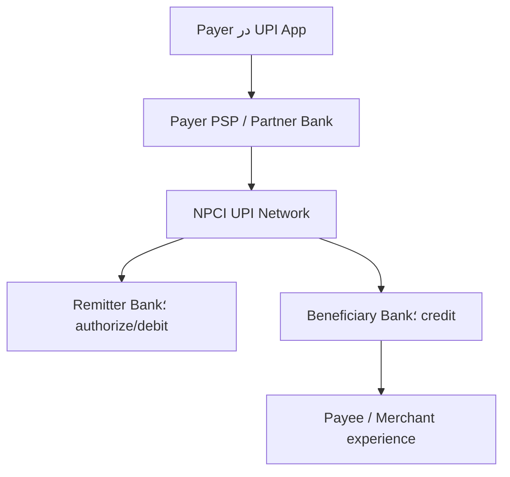

<!-- bidi: rtl; code: ltr -->
<div dir="rtl" align="right">

# پروندهٔ <bdi dir="ltr">Week 01</bdi> — <bdi dir="ltr">UPI</bdi> هند؛ از یک <bdi dir="ltr">Capability</bdi> تا شبکه‌ای با میلیاردها تراکنش

- <bdi dir="ltr">Case type:</bdi> زیرساخت پرداخت آنی و <bdi dir="ltr">interoperable</bdi>؛ **نه <bdi dir="ltr">Core Ledger</bdi> و نه یک <bdi dir="ltr">Mobile App</bdi> منفرد**
- <bdi dir="ltr">Relevance: Capability Map</bdi>، <bdi dir="ltr">System boundary</bdi>، نقش‌ها، <bdi dir="ltr">API Contract</bdi>، <bdi dir="ltr">Ownership</bdi> و <bdi dir="ltr">Failure amplification</bdi>
- <bdi dir="ltr">Evidence checked:</bdi> **<bdi dir="ltr">15 August 2026</bdi>**
- <bdi dir="ltr">Reading/analysis budget: 45 minutes</bdi>
- <bdi dir="ltr">Evidence rule: Fact</bdi>های جاری از <bdi dir="ltr">NPCI/RBI</bdi>؛ جزئیات <bdi dir="ltr">Runtime</bdi> غیرعمومی با <bdi dir="ltr">`UNKNOWN`</bdi>؛ <bdi dir="ltr">Domain map</bdi> این پرونده <bdi dir="ltr">`INFERENCE`</bdi> تحلیلی است.

## 1. چرا <bdi dir="ltr">UPI</bdi> برای <bdi dir="ltr">Week 01</bdi>؟

<bdi dir="ltr">UPI</bdi> یک آزمایش ذهنی عالی برای همان خطایی است که در <bdi dir="ltr">Week 01</bdi> می‌خواهیم حذف کنیم. در گفت‌وگوی روزمره ممکن است همهٔ این‌ها «<bdi dir="ltr">UPI</bdi>» نامیده شوند:

- توانایی پرداخت آنی از حساب بانکی
- شبکه و <bdi dir="ltr">Scheme</bdi> تحت راهبری <bdi dir="ltr">NPCI</bdi>
- <bdi dir="ltr">App</bdi>هایی مانند <bdi dir="ltr">BHIM</bdi> یا <bdi dir="ltr">Third-party app</bdi>
- <bdi dir="ltr">PSP Bank</bdi> و بانک صادرکننده/ذی‌نفع
- مجموعه‌ای از <bdi dir="ltr">API</bdi>ها، شناسه‌ها و قواعد عملیاتی
- <bdi dir="ltr">QR</bdi> روی میز فروشنده
- تجربهٔ مشتری و رسید پرداخت

اگر این سطح‌ها را یکی بگیریم، معماری غلط می‌شود. <bdi dir="ltr">App</bdi> مالک ماندهٔ سپرده نیست؛ <bdi dir="ltr">QR</bdi> خود <bdi dir="ltr">Payment System</bdi> نیست؛ <bdi dir="ltr">API</bdi> یک <bdi dir="ltr">Capability</bdi> نیست؛ و شبکهٔ <bdi dir="ltr">UPI</bdi> جای <bdi dir="ltr">Core Banking</bdi> بانک‌های عضو را نمی‌گیرد.

پرسش محوری پرونده:

> چگونه یک <bdi dir="ltr">Capability</bdi> عمومی با نقش‌ها و <bdi dir="ltr">Contract</bdi>های استاندارد به اکوسیستم بزرگی تبدیل شد، در حالی که <bdi dir="ltr">Authority</bdi> مانده و <bdi dir="ltr">Debit/Credit</bdi> نهایی در بانک‌های عضو باقی ماند؟

## 2. هویت و <bdi dir="ltr">Scope</bdi>

### <bdi dir="ltr">FACT</bdi> — <bdi dir="ltr">primary</bdi>

[<bdi dir="ltr">NPCI</bdi>](https://www.npci.org.in/) سازمان چتری زیرساخت‌های پرداخت خرد هند است و محصولاتی مانند <bdi dir="ltr">UPI</bdi>، <bdi dir="ltr">IMPS</bdi>، <bdi dir="ltr">RuPay</bdi>، <bdi dir="ltr">NACH</bdi> و <bdi dir="ltr">FASTag</bdi> را راهبری می‌کند. صفحهٔ رسمی <bdi dir="ltr">UPI</bdi> آن را سیستمی معرفی می‌کند که چند حساب بانکی/مجاز را در یک <bdi dir="ltr">App</bdi> قابل استفاده می‌کند و قابلیت‌هایی مانند انتقال وجه و پرداخت <bdi dir="ltr">Merchant</bdi> را در یک تجربهٔ مشترک می‌آورد.

### <bdi dir="ltr">Scope</bdi> این پرونده

در این <bdi dir="ltr">Week</bdi> بررسی می‌کنیم:

- تولد <bdi dir="ltr">UPI</bdi> و مسئله‌ای که حل کرد
- بازیگران و مرز مسئولیت عمومی
- تکامل <bdi dir="ltr">Capability</bdi>ها و <bdi dir="ltr">Product feature</bdi>ها
- <bdi dir="ltr">Contract</bdi> و <bdi dir="ltr">Flow</bdi> مفهومی <bdi dir="ltr">Push payment</bdi>
- <bdi dir="ltr">Failure</bdi>های عملیاتی و کنترل بار
- تفکیک <bdi dir="ltr">Fact</bdi>، <bdi dir="ltr">Inference</bdi> و <bdi dir="ltr">Unknown</bdi> در معماری فعلی

بررسی نمی‌کنیم:

- کد، دیتابیس یا <bdi dir="ltr">Topology</bdi> داخلی محرمانهٔ <bdi dir="ltr">NPCI</bdi>
- الگوریتم دقیق <bdi dir="ltr">Fraud detection</bdi> بانک‌ها
- تسویه و حسابداری کامل شبکه
- مقایسهٔ حقوقی <bdi dir="ltr">UPI</bdi> با شتاب/شتابک ایران

## 3. مسئله‌ای که باعث تولد شد

پیش از <bdi dir="ltr">UPI</bdi>، هند ابزارهایی مانند <bdi dir="ltr">NEFT</bdi>، <bdi dir="ltr">RTGS</bdi> و <bdi dir="ltr">IMPS</bdi> داشت. <bdi dir="ltr">IMPS</bdi> امکان انتقال آنی را ایجاد کرده بود، اما تجربهٔ پرداخت بین <bdi dir="ltr">App</bdi>ها، بانک‌ها، شناسه‌ها و <bdi dir="ltr">Merchant</bdi>ها هنوز یکپارچه نبود.

### مسئلهٔ <bdi dir="ltr">Capability</bdi>

کاربر باید بتواند:

- از <bdi dir="ltr">App</bdi> دلخواه به حساب بانکی خود دسترسی پرداختی داشته باشد.
- بدون افشای شماره حساب در هر تعامل، گیرنده را با شناسهٔ قابل‌استفاده پیدا کند.
- به فرد یا <bdi dir="ltr">Merchant</bdi> در شبکه‌ای <bdi dir="ltr">interoperable</bdi> پرداخت کند.
- نتیجه و شناسهٔ تراکنش را سریع دریافت کند.

بانک/شبکه باید بتواند:

- <bdi dir="ltr">Participant</bdi> را شناسایی و <bdi dir="ltr">Route</bdi> کند.
- <bdi dir="ltr">Authorization</bdi> و <bdi dir="ltr">Debit/Credit</bdi> را میان <bdi dir="ltr">Owner</bdi>های درست هماهنگ کند.
- وضعیت، <bdi dir="ltr">Failure</bdi>، <bdi dir="ltr">Reversal</bdi>، <bdi dir="ltr">Complaint</bdi> و <bdi dir="ltr">Reconciliation</bdi> را مدیریت کند.

<bdi dir="ltr">UPI</bdi> یک «اپ بهتر» نبود؛ یک مدل تعامل چندبازیگر و <bdi dir="ltr">Contract</bdi> مشترک بود.

## <bdi dir="ltr">4. Timeline</bdi>؛ از تولد تا وضعیت جاری

| زمان | رویداد | برچسب و معنای معماری |
|---|---|---|
| 2008 | ایجاد <bdi dir="ltr">NPCI</bdi> به‌عنوان سازمان چتری پرداخت خرد | <bdi dir="ltr">`FACT — primary`</bdi>؛ ایجاد <bdi dir="ltr">Operator</bdi> و <bdi dir="ltr">Governance</bdi> مشترک |
| 2010 | آغاز <bdi dir="ltr">IMPS</bdi> و تجربهٔ انتقال آنی بین‌بانکی | <bdi dir="ltr">`FACT — primary`</bdi>؛ پایهٔ عملیاتی مهم پیش از <bdi dir="ltr">UPI</bdi> |
| <bdi dir="ltr">11 Apr 2016</bdi> | <bdi dir="ltr">Pilot</bdi> رسمی <bdi dir="ltr">UPI</bdi> با حضور رئیس وقت <bdi dir="ltr">RBI</bdi> | <bdi dir="ltr">`FACT — primary`</bdi> از [<bdi dir="ltr">NPCI About UPI</bdi>](https://www.npci.org.in/product/upi/about-upi) |
| <bdi dir="ltr">Aug 2016</bdi> | آغاز عرضهٔ <bdi dir="ltr">App</bdi>های بانکی روی <bdi dir="ltr">UPI</bdi> | <bdi dir="ltr">`FACT — primary`</bdi>؛ جداسازی <bdi dir="ltr">Scheme/Network</bdi> از <bdi dir="ltr">App ecosystem</bdi> |
| 2018 | <bdi dir="ltr">UPI 2.0</bdi> و توسعهٔ <bdi dir="ltr">Use case</bdi>ها مانند <bdi dir="ltr">Mandate/Invoice</bdi> و امکانات پرداخت | <bdi dir="ltr">`FACT — primary`</bdi> در تاریخچهٔ <bdi dir="ltr">NPCI</bdi>؛ <bdi dir="ltr">Contract</bdi> تکامل یافت، <bdi dir="ltr">Capability</bdi> ثابت نماند |
| 2020 | <bdi dir="ltr">UPI AutoPay</bdi> برای <bdi dir="ltr">e-mandate</bdi> و پرداخت تکرارشونده | <bdi dir="ltr">`FACT — primary`</bdi> از [<bdi dir="ltr">NPCI AutoPay</bdi>](https://www.npci.org.in/product/autopay) |
| 2022 | <bdi dir="ltr">UPI 123PAY</bdi> برای <bdi dir="ltr">Feature phone</bdi> و <bdi dir="ltr">UPI Lite</bdi> برای پرداخت کم‌مبلغ | <bdi dir="ltr">`FACT — primary`</bdi> در اسناد <bdi dir="ltr">RBI/NPCI</bdi>؛ <bdi dir="ltr">Accessibility</bdi> و <bdi dir="ltr">Load isolation</bdi> به <bdi dir="ltr">Capability</bdi> تبدیل شد |
| <bdi dir="ltr">Sep 2023</bdi> | <bdi dir="ltr">UPI Lite X</bdi>، پرداخت <bdi dir="ltr">Conversational</bdi> و گسترش <bdi dir="ltr">Credit on UPI</bdi> | <bdi dir="ltr">`FACT — primary`</bdi> در [<bdi dir="ltr">NSFI 2025</bdi>–<bdi dir="ltr">30 RBI</bdi>](https://www.rbi.org.in/commonman/Upload/English/Content/PDFs/English12052026.pdf) |
| 2024 | <bdi dir="ltr">UPI Circle</bdi> برای تفویض مجوز پرداخت با <bdi dir="ltr">Limit</bdi> | <bdi dir="ltr">`FACT — primary`</bdi> از [<bdi dir="ltr">NPCI UPI Circle</bdi>](https://www.npci.org.in/product/upi-circle) |
| <bdi dir="ltr">Apr</bdi>–<bdi dir="ltr">May 2025</bdi> | چند اختلال گسترده و فشار ناشی از <bdi dir="ltr">Status check/</bdi>بار اکوسیستم | <bdi dir="ltr">`FACT — secondary`</bdi>؛ درس <bdi dir="ltr">Rate limit</bdi> و <bdi dir="ltr">Ecosystem ownership</bdi> |
| <bdi dir="ltr">Jul 2026</bdi> | 741 بانک <bdi dir="ltr">Live</bdi>، 23,658.35 میلیون تراکنش و ارزش 29,87,<bdi dir="ltr">880.49 crore</bdi> روپیه در یک ماه | <bdi dir="ltr">`FACT — primary`</bdi> از [<bdi dir="ltr">NPCI Product Statistics</bdi>](https://www.npci.org.in/product/upi/product-statistics)؛ <bdi dir="ltr">Current-state</bdi> در تاریخ کنترل |

<bdi dir="ltr">Timeline</bdi> نشان می‌دهد معماری فقط <bdi dir="ltr">Scale-out</bdi> زیرساخت نیست. هر مرحله بازیگر، <bdi dir="ltr">Rule</bdi>، <bdi dir="ltr">Failure mode</bdi> و <bdi dir="ltr">Contract</bdi> تازه‌ای اضافه کرده است.

## 5. تحول محصول و مدل اکوسیستم

### 5.1 از انتقال فردی به <bdi dir="ltr">Merchant platform</bdi>

<bdi dir="ltr">UPI</bdi> از <bdi dir="ltr">P2P</bdi> و انتقال حساب‌به‌حساب به <bdi dir="ltr">P2M</bdi>، <bdi dir="ltr">QR</bdi> ثابت/پویا، <bdi dir="ltr">Intent</bdi>، <bdi dir="ltr">Collect</bdi> و پرداخت داخل <bdi dir="ltr">App/Web</bdi> گسترش یافت. شبکهٔ مشترک اجازه داد <bdi dir="ltr">App</bdi> و <bdi dir="ltr">Merchant experience</bdi> رقابت کند، درحالی‌که <bdi dir="ltr">Contract</bdi> و <bdi dir="ltr">Participant rules</bdi> مشترک بماند.

### <bdi dir="ltr">5.2 AutoPay</bdi> و <bdi dir="ltr">Mandate</bdi>

پرداخت تکرارشونده دیگر یک <bdi dir="ltr">Transfer</bdi> ساده نیست. <bdi dir="ltr">Lifecycle</bdi> مجوز، <bdi dir="ltr">Limit</bdi>، <bdi dir="ltr">Revocation</bdi>، <bdi dir="ltr">Schedule</bdi> و <bdi dir="ltr">Failure retry</bdi> وارد مدل می‌شود. نتیجهٔ معماری: <bdi dir="ltr">`Payment`</bdi> واحدِ همه‌کاره کافی نیست؛ <bdi dir="ltr">Mandate capability</bdi> و <bdi dir="ltr">State</bdi> مستقل می‌خواهد.

### <bdi dir="ltr">5.3 UPI Lite</bdi> و <bdi dir="ltr">Lite X</bdi>

طبق سند <bdi dir="ltr">RBI</bdi>، <bdi dir="ltr">UPI Lite</bdi> برای پرداخت کم‌مبلغ طوری طراحی شده که هر تراکنش در لحظه به <bdi dir="ltr">Core Banking</bdi> بانک <bdi dir="ltr">Remitter</bdi> برخورد نکند؛ هدف کاهش بار <bdi dir="ltr">CBS</bdi> و افزایش <bdi dir="ltr">Success rate</bdi> است. <bdi dir="ltr">Lite X</bdi> قابلیت <bdi dir="ltr">Offline</bdi> را اضافه کرد.

درس مهم: بهینه‌سازی <bdi dir="ltr">Performance</bdi> فقط <bdi dir="ltr">Cache</bdi> فنی نیست؛ مدل <bdi dir="ltr">Authorisation</bdi>، <bdi dir="ltr">Risk</bdi>، <bdi dir="ltr">Limit</bdi> و <bdi dir="ltr">Reconciliation</bdi> را تغییر می‌دهد.

### <bdi dir="ltr">5.4 UPI 123PAY</bdi> و <bdi dir="ltr">Conversational payment</bdi>

گسترش به <bdi dir="ltr">Feature phone</bdi> و زبان/تعامل <bdi dir="ltr">Conversational</bdi> نشان داد <bdi dir="ltr">Capability</bdi> «دسترسی به پرداخت» از <bdi dir="ltr">Mobile App</bdi> هوشمند مستقل است. <bdi dir="ltr">Channel</bdi> تغییر کرد اما <bdi dir="ltr">Debit authority</bdi> و شبکهٔ پرداخت باقی ماند.

### <bdi dir="ltr">5.5 Credit Line on UPI</bdi>

[<bdi dir="ltr">Credit Line on UPI</bdi>](https://www.npci.org.in/product/upi/credit-line-on-upi) خط اعتباری از پیش مصوب بانک را برای پرداخت‌های کم‌مبلغ و پرتعداد در دسترس قرار می‌دهد. این ویژگی مرز <bdi dir="ltr">Payments</bdi> و <bdi dir="ltr">Lending</bdi> را به هم متصل می‌کند، اما یکی‌شدن <bdi dir="ltr">Ownership</bdi> آن‌ها را ثابت نمی‌کند.

### <bdi dir="ltr">5.6 UPI Circle</bdi>

[<bdi dir="ltr">UPI Circle</bdi>](https://www.npci.org.in/product/upi-circle) به <bdi dir="ltr">Payer</bdi> اجازه می‌دهد تحت <bdi dir="ltr">Limit</bdi> به فرد دیگری اختیار تراکنش بدهد. این تغییر کوچک <bdi dir="ltr">UX</bdi> نیست؛ <bdi dir="ltr">Delegation</bdi>، <bdi dir="ltr">Consent</bdi>، <bdi dir="ltr">Limit</bdi>، <bdi dir="ltr">Revocation</bdi> و <bdi dir="ltr">Audit trail</bdi> را به مدل اضافه می‌کند.

## 6. معماری عمومی و <bdi dir="ltr">Technology stack</bdi> فعلی

### 6.1 چیزهایی که می‌دانیم — <bdi dir="ltr">FACT</bdi>

<bdi dir="ltr">NPCI</bdi> بازیگران <bdi dir="ltr">UPI</bdi> را شامل <bdi dir="ltr">App</bdi>، <bdi dir="ltr">Payer PSP</bdi>، <bdi dir="ltr">Remitter Bank</bdi>، <bdi dir="ltr">Beneficiary Bank</bdi>، <bdi dir="ltr">Payee PSP</bdi> و خود <bdi dir="ltr">NPCI</bdi> معرفی می‌کند. فهرست رسمی اعضا نقش‌های <bdi dir="ltr">Issuer</bdi> و <bdi dir="ltr">PSP</bdi> را جدا نمایش می‌دهد.


</div>

<div dir="ltr" align="left">



</div>

<div dir="rtl" align="right">


این <bdi dir="ltr">Diagram</bdi> ترتیب <bdi dir="ltr">Protocol</bdi> قطعی همهٔ <bdi dir="ltr">Use case</bdi>ها نیست؛ نمای آموزشی <bdi dir="ltr">Push payment</bdi> است.

### <bdi dir="ltr">6.2 Flow</bdi> مفهومی <bdi dir="ltr">Push payment</bdi> — <bdi dir="ltr">FACT</bdi> + <bdi dir="ltr">simplification</bdi>

1. <bdi dir="ltr">Payer</bdi> در <bdi dir="ltr">App</bdi> گیرنده، مبلغ و حساب پرداخت را انتخاب می‌کند.
2. <bdi dir="ltr">App/PSP</bdi> درخواست را با شناسه و <bdi dir="ltr">Credential</bdi> لازم به شبکه می‌فرستد.
3. <bdi dir="ltr">UPI Participant</bdi> و مقصد را <bdi dir="ltr">Resolve/Route</bdi> می‌کند.
4. <bdi dir="ltr">Remitter Bank</bdi> احراز/مجوز و امکان <bdi dir="ltr">Debit</bdi> را بر اساس <bdi dir="ltr">Rule</bdi> خودش بررسی می‌کند.
5. <bdi dir="ltr">Beneficiary Bank Credit</bdi> را اعمال و نتیجه را برمی‌گرداند.
6. وضعیت و <bdi dir="ltr">Reference</bdi> به <bdi dir="ltr">Participant</bdi>ها و کاربر ابلاغ می‌شود.
7. موارد <bdi dir="ltr">Pending/Failed</bdi> نیازمند <bdi dir="ltr">status</bdi>، <bdi dir="ltr">reversal</bdi>، <bdi dir="ltr">complaint</bdi> و <bdi dir="ltr">reconciliation</bdi> هستند.

### <bdi dir="ltr">6.3 Ownership</bdi> عمومی

| <bdi dir="ltr">Fact/Decision</bdi> | <bdi dir="ltr">Authority</bdi> محتمل | برچسب |
|---|---|---|
| مانده و امکان <bdi dir="ltr">Debit</bdi> حساب <bdi dir="ltr">Payer</bdi> | <bdi dir="ltr">Remitter Bank/Core Banking</bdi> | <bdi dir="ltr">`FACT/strong inference`</bdi> از نقش بانک |
| ثبت <bdi dir="ltr">Credit</bdi> حساب گیرنده | <bdi dir="ltr">Beneficiary Bank</bdi> | <bdi dir="ltr">`FACT/strong inference`</bdi> |
| <bdi dir="ltr">Route</bdi> و <bdi dir="ltr">Scheme rules</bdi> | <bdi dir="ltr">NPCI/UPI network governance</bdi> | <bdi dir="ltr">`FACT`</bdi> |
| <bdi dir="ltr">App UX</bdi> و <bdi dir="ltr">initiation experience</bdi> | <bdi dir="ltr">PSP/TPAP</bdi> تحت قواعد <bdi dir="ltr">Scheme</bdi> | <bdi dir="ltr">`FACT`</bdi> |
| <bdi dir="ltr">UPI handle mapping</bdi> | <bdi dir="ltr">UPI ecosystem role</bdi>؛ جزئیات مالکیت پیاده‌سازی نیازمند <bdi dir="ltr">Spec</bdi> | <bdi dir="ltr">`UNKNOWN at implementation detail`</bdi> |
| <bdi dir="ltr">Fraud decision</bdi> نهایی | چندلایه میان <bdi dir="ltr">App</bdi>، <bdi dir="ltr">PSP</bdi>، بانک و شبکه | <bdi dir="ltr">`INFERENCE`</bdi>; جزئیات غیرعمومی |

### <bdi dir="ltr">6.4 Technology</bdi>هایی که می‌دانیم

- <bdi dir="ltr">Mobile/feature-phone/QR/Intent</bdi> و <bdi dir="ltr">API-based participant integration</bdi> به‌صورت عمومی مستندند.
- <bdi dir="ltr">UPI PIN</bdi> و سازوکارهای <bdi dir="ltr">Authentication/Authorisation</bdi> بخشی از تجربه و <bdi dir="ltr">Scheme</bdi> هستند.
- <bdi dir="ltr">Circular</bdi>ها قواعد <bdi dir="ltr">Operation</bdi>، <bdi dir="ltr">Limit</bdi>، <bdi dir="ltr">Branding</bdi>، <bdi dir="ltr">complaint</bdi> و تغییرات <bdi dir="ltr">Contract</bdi> را به <bdi dir="ltr">Participant</bdi>ها ابلاغ می‌کنند.
- <bdi dir="ltr">UPI Lite/Lite X</bdi> مسیرهای متفاوت برای پرداخت کم‌مبلغ و <bdi dir="ltr">Offline</bdi> دارند.

### 6.5 چیزهایی که عمداً <bdi dir="ltr">UNKNOWN</bdi> می‌مانند

منابع عمومی بررسی‌شده این موارد را با دقت <bdi dir="ltr">production-grade</bdi> افشا نمی‌کنند:

- زبان‌های برنامه‌نویسی و <bdi dir="ltr">Framework</bdi>های <bdi dir="ltr">Core UPI switch</bdi>
- نوع و <bdi dir="ltr">Topology</bdi> دیتابیس‌های داخلی
- تعداد <bdi dir="ltr">Service</bdi>ها یا اینکه <bdi dir="ltr">Microservice/Monolith</bdi> هستند
- <bdi dir="ltr">Cloud/on-prem split</bdi> و <bdi dir="ltr">Cluster topology</bdi>
- الگوریتم دقیق <bdi dir="ltr">Partitioning</bdi>، <bdi dir="ltr">Queueing</bdi> و <bdi dir="ltr">Failover</bdi>
- ظرفیت هر <bdi dir="ltr">Region</bdi> و <bdi dir="ltr">RPO/RTO</bdi> واقعی
- <bdi dir="ltr">Rule engine</bdi> و مدل <bdi dir="ltr">Fraud</bdi> داخلی

پس نوشتن «<bdi dir="ltr">UPI</bdi> حتماً <bdi dir="ltr">Kafka</bdi> + <bdi dir="ltr">Kubernetes</bdi> + <bdi dir="ltr">Microservices</bdi> دارد» **حدس** است و در این پرونده پذیرفته نیست.

## <bdi dir="ltr">7. Capability/Domain Map</bdi> تحلیلی

این <bdi dir="ltr">Map</bdi> بازسازی ساختار محرمانهٔ <bdi dir="ltr">NPCI</bdi> نیست؛ <bdi dir="ltr">`INFERENCE`</bdi> برای تمرین <bdi dir="ltr">Week 01</bdi> است.

| <bdi dir="ltr">Capability</bdi> | <bdi dir="ltr">Domain/Context hypothesis</bdi> | <bdi dir="ltr">Owner hypothesis</bdi> | <bdi dir="ltr">Evidence/uncertainty</bdi> |
|---|---|---|---|
| <bdi dir="ltr">Participant onboarding</bdi> & <bdi dir="ltr">certification</bdi> | <bdi dir="ltr">Scheme/Participant Management</bdi> | <bdi dir="ltr">NPCI</bdi> | نقش و <bdi dir="ltr">Member list</bdi> عمومی؛ مدل داخلی <bdi dir="ltr">Unknown</bdi> |
| <bdi dir="ltr">UPI identity/handle management</bdi> | <bdi dir="ltr">Addressing</bdi> & <bdi dir="ltr">Alias</bdi> | <bdi dir="ltr">PSP/NPCI ecosystem</bdi> | وجود <bdi dir="ltr">VPA Fact</bdi>؛ <bdi dir="ltr">Authority</bdi> دقیق وابسته به <bdi dir="ltr">Spec</bdi> |
| <bdi dir="ltr">Payment initiation</bdi> | <bdi dir="ltr">Payment Experience</bdi> | <bdi dir="ltr">App/PSP</bdi> | <bdi dir="ltr">Product flow</bdi> عمومی |
| <bdi dir="ltr">Authentication/authorisation</bdi> | <bdi dir="ltr">Payment Authorisation</bdi> | <bdi dir="ltr">Payer PSP</bdi> + <bdi dir="ltr">Remitter Bank</bdi> | نقش‌ها عمومی؛ <bdi dir="ltr">Control details</bdi> محرمانه |
| <bdi dir="ltr">Routing</bdi> | <bdi dir="ltr">Payment Network Switching</bdi> | <bdi dir="ltr">NPCI</bdi> | <bdi dir="ltr">Operator role</bdi> عمومی |
| <bdi dir="ltr">Account debit</bdi> | <bdi dir="ltr">Deposit/Core Banking</bdi> | <bdi dir="ltr">Remitter Bank</bdi> | <bdi dir="ltr">Bank balance authority</bdi> |
| <bdi dir="ltr">Account credit</bdi> | <bdi dir="ltr">Deposit/Core Banking</bdi> | <bdi dir="ltr">Beneficiary Bank</bdi> | <bdi dir="ltr">Bank posting authority</bdi> |
| <bdi dir="ltr">Transaction status</bdi> | <bdi dir="ltr">Network Transaction State</bdi> | <bdi dir="ltr">Shared contract with one authoritative state model needed</bdi> | دقیقاً محل <bdi dir="ltr">Authority</bdi> نیازمند <bdi dir="ltr">Spec</bdi> |
| <bdi dir="ltr">Mandate lifecycle</bdi> | <bdi dir="ltr">Mandate/AutoPay</bdi> | <bdi dir="ltr">Scheme</bdi> + <bdi dir="ltr">participant roles</bdi> | <bdi dir="ltr">AutoPay product evidence</bdi> |
| <bdi dir="ltr">Delegated payment</bdi> | <bdi dir="ltr">Delegation/Consent</bdi> | <bdi dir="ltr">Payer bank/PSP under UPI Circle</bdi> | <bdi dir="ltr">Product evidence</bdi>؛ <bdi dir="ltr">Context boundary inference</bdi> |
| <bdi dir="ltr">Dispute/complaint/chargeback</bdi> | <bdi dir="ltr">Dispute Management</bdi> | چندبازیگر با <bdi dir="ltr">Scheme rules</bdi> | <bdi dir="ltr">Complaint/circular evidence</bdi> |
| <bdi dir="ltr">Settlement</bdi> & <bdi dir="ltr">reconciliation</bdi> | <bdi dir="ltr">Clearing/Settlement</bdi> | <bdi dir="ltr">NPCI</bdi> + <bdi dir="ltr">member banks</bdi> | وجود عملیاتی قطعی؛ جزئیات خارج <bdi dir="ltr">Scope</bdi> |
| <bdi dir="ltr">Fraud/risk control</bdi> | <bdi dir="ltr">Risk</bdi> & <bdi dir="ltr">Fraud</bdi> | <bdi dir="ltr">Layered</bdi> | مدل و <bdi dir="ltr">Rule</bdi>ها <bdi dir="ltr">Unknown</bdi> |
| <bdi dir="ltr">Network operations</bdi> | <bdi dir="ltr">Platform Reliability</bdi> | <bdi dir="ltr">NPCI</bdi> + <bdi dir="ltr">Participant SRE</bdi> | <bdi dir="ltr">outage/circular evidence</bdi> |

نکتهٔ آموزشی: یک <bdi dir="ltr">Capability</bdi> مانند «پرداخت آنی» به چند <bdi dir="ltr">Context</bdi> و <bdi dir="ltr">Owner</bdi> می‌شکند. یک نام <bdi dir="ltr">Product</bdi> نمی‌تواند همه را در یک <bdi dir="ltr">`UpiService`</bdi> پنهان کند.

## 8. اشتباه‌ها، شکست‌ها و شرط‌بندی‌های پرهزینه

### <bdi dir="ltr">8.1 Outage</bdi> و <bdi dir="ltr">Retry amplification</bdi> در 2025

<bdi dir="ltr">`FACT — secondary`</bdi>: گزارش‌های عمومی دربارهٔ اختلال‌های <bdi dir="ltr">April</bdi> و <bdi dir="ltr">May 2025</bdi> نشان می‌دهند <bdi dir="ltr">UPI</bdi> در مقیاس ملی چند بار دچار افت/قطعی شد. یک گزارش دربارهٔ رخداد <bdi dir="ltr">12 April</bdi>، با استناد به بررسی <bdi dir="ltr">NPCI</bdi>، <bdi dir="ltr">Flood</bdi> شدن <bdi dir="ltr">`Check Transaction`</bdi> از سوی برخی <bdi dir="ltr">PSP Bank</bdi>ها را عامل فشار معرفی کرد؛ یعنی مکانیزمی که برای بازیابی وضعیت بود، خود به <bdi dir="ltr">Amplifier</bdi> بار تبدیل شد.

درس فنی:


</div>

<div dir="ltr" align="left">

```text
timeout
  → clients/participants check status aggressively
  → control-plane/read load rises
  → core path slows further
  → more timeout and more checks
```

</div>

<div dir="rtl" align="right">


<bdi dir="ltr">Retry</bdi> بدون <bdi dir="ltr">Backoff</bdi>، <bdi dir="ltr">Jitter</bdi>، <bdi dir="ltr">Rate limit</bdi>، <bdi dir="ltr">Idempotency</bdi> و <bdi dir="ltr">Load shedding</bdi> قابلیت اطمینان نیست؛ حلقهٔ بازخورد منفی است.

### <bdi dir="ltr">8.2 Governance</bdi> فقط در سند کافی نیست

<bdi dir="ltr">`INFERENCE`</bdi>: اگر <bdi dir="ltr">Limit</bdi> فراخوانی فقط به رعایت <bdi dir="ltr">Participant</bdi> وابسته باشد و <bdi dir="ltr">Enforcement</bdi> مرکزی یا <bdi dir="ltr">Capacity isolation</bdi> کافی نباشد، یک عضو می‌تواند روی کل اکوسیستم اثر بگذارد. این پرونده جزئیات <bdi dir="ltr">Control</bdi> فعلی را نمی‌داند، اما [<bdi dir="ltr">Circular</bdi>های <bdi dir="ltr">UPI</bdi>](https://www.npci.org.in/circulars/upi) نشان می‌دهند <bdi dir="ltr">Operation rules</bdi> به‌طور مستمر اصلاح می‌شوند.

### <bdi dir="ltr">8.3 Success rate</bdi> یک مسئلهٔ <bdi dir="ltr">End-to-end</bdi> است

<bdi dir="ltr">`INFERENCE`</bdi>: <bdi dir="ltr">UPI Network</bdi> ممکن است سالم باشد ولی <bdi dir="ltr">Core Banking</bdi> بانک فرستنده/گیرنده، <bdi dir="ltr">Middleware</bdi> یا <bdi dir="ltr">PSP</bdi> پاسخ ندهد. مالک تجربهٔ شکست از دید مشتری واحد است، اما <bdi dir="ltr">Root cause</bdi> و <bdi dir="ltr">Authority</bdi> توزیع شده‌اند. <bdi dir="ltr">SLO</bdi> باید <bdi dir="ltr">Dependency</bdi> و <bdi dir="ltr">Error attribution</bdi> داشته باشد.

### <bdi dir="ltr">8.4 Fraud</bdi> همیشه <bdi dir="ltr">Protocol breach</bdi> نیست

<bdi dir="ltr">`FACT — primary`</bdi>: [<bdi dir="ltr">NPCI Safety Shield</bdi>](https://www.npci.org.in/safety-feature) هشدار می‌دهد <bdi dir="ltr">UPI PIN</bdi> فقط برای کسر وجه وارد می‌شود. وجود این آموزش نشان می‌دهد <bdi dir="ltr">Social engineering</bdi> و ابهام جهت پرداخت یک <bdi dir="ltr">Failure mode</bdi> مهم اکوسیستم است.

درس معماری: <bdi dir="ltr">Security</bdi> فقط <bdi dir="ltr">Encryption</bdi> نیست؛ نام <bdi dir="ltr">Action</bdi>، <bdi dir="ltr">Confirmation screen</bdi>، نمایش گیرنده/مبلغ و تمایز <bdi dir="ltr">Receive</bdi> از <bdi dir="ltr">Pay</bdi> بخشی از <bdi dir="ltr">Control</bdi> هستند.

### <bdi dir="ltr">8.5 Concentration</bdi> و <bdi dir="ltr">Single logical network</bdi>

<bdi dir="ltr">`INFERENCE`</bdi>: موفقیت <bdi dir="ltr">UPI</bdi> وابستگی ملی به یک <bdi dir="ltr">Scheme/Network</bdi> منطقی را بالا برده است. این الزاماً «اشتباه» نیست؛ مزیت <bdi dir="ltr">interoperability</bdi> همین تمرکز <bdi dir="ltr">Contract</bdi> است. اما <bdi dir="ltr">Blast radius</bdi>، <bdi dir="ltr">DR</bdi>، <bdi dir="ltr">participant diversity</bdi> و <bdi dir="ltr">alternative rails</bdi> باید در <bdi dir="ltr">Governance</bdi> دیده شوند. جزئیات <bdi dir="ltr">Topology</bdi> داخلی برای قضاوت قطعی <bdi dir="ltr">`UNKNOWN`</bdi> است.

## 9. دستاوردهای جاری تا <bdi dir="ltr">15 August 2026</bdi>

### <bdi dir="ltr">Scale</bdi>

صفحهٔ رسمی آمار <bdi dir="ltr">NPCI</bdi> برای <bdi dir="ltr">July 2026</bdi> گزارش می‌کند:

- **741** بانک <bdi dir="ltr">Live</bdi>
- **23,<bdi dir="ltr">658.35 million</bdi>** تراکنش در ماه
- ارزش **29,87,<bdi dir="ltr">880.49 crore rupees</bdi>**

عددها را با واحد اصلی نگه داشته‌ایم تا خطای تبدیل رخ ندهد.

### <bdi dir="ltr">Capability expansion</bdi>

- <bdi dir="ltr">UPI Lite</bdi> برای کاهش فشار پرداخت‌های کم‌مبلغ بر <bdi dir="ltr">CBS</bdi>
- <bdi dir="ltr">Lite X</bdi> برای سناریوی <bdi dir="ltr">Offline</bdi>
- <bdi dir="ltr">123PAY</bdi> برای <bdi dir="ltr">Feature phone</bdi>
- <bdi dir="ltr">AutoPay</bdi> برای <bdi dir="ltr">Mandate</bdi> تکرارشونده
- <bdi dir="ltr">Credit Line on UPI</bdi> برای اتصال اعتبار مصوب به پرداخت
- <bdi dir="ltr">UPI Circle</bdi> برای <bdi dir="ltr">Delegated authorisation</bdi>
- <bdi dir="ltr">QR</bdi> و <bdi dir="ltr">Intent</bdi> برای <bdi dir="ltr">Interoperable merchant acceptance</bdi>

### <bdi dir="ltr">Authentication evolution</bdi>

صفحهٔ <bdi dir="ltr">Press Release</bdi> رسمی <bdi dir="ltr">NPCI</bdi> در 2026 از عبور تراکنش‌های <bdi dir="ltr">UPI</bdi> مبتنی بر <bdi dir="ltr">Biometric Authentication</bdi>، با احتساب <bdi dir="ltr">RuPay Credit Card on UPI</bdi>، از **<bdi dir="ltr">600 million</bdi> در <bdi dir="ltr">June 2026</bdi>** خبر می‌دهد. این دستاورد باید با <bdi dir="ltr">Scope</bdi> همان <bdi dir="ltr">Release</bdi> خوانده شود و به همهٔ <bdi dir="ltr">UPI</bdi> تعمیم داده نشود.

## 10. درس‌های قابل انتقال به <bdi dir="ltr">Core Banking Lab</bdi>

### قابل انتقال

1. **از <bdi dir="ltr">Capability</bdi> شروع کن:** مسئله پرداخت آنی بود، نه ساخت یک <bdi dir="ltr">App</bdi> یا <bdi dir="ltr">Microservice</bdi> خاص.
2. **<bdi dir="ltr">Role</bdi> و <bdi dir="ltr">Authority</bdi> را صریح کن:** <bdi dir="ltr">App</bdi>، <bdi dir="ltr">PSP</bdi>، <bdi dir="ltr">Network</bdi> و <bdi dir="ltr">Bank</bdi> مسئولیت یکسان ندارند.
3. **<bdi dir="ltr">Contract</bdi> استاندارد اکوسیستم می‌سازد:** <bdi dir="ltr">Interoperability</bdi> از <bdi dir="ltr">Contract</bdi> و <bdi dir="ltr">Governance</bdi> می‌آید، نه <bdi dir="ltr">Database</bdi> مشترک.
4. **<bdi dir="ltr">Core Ledger</bdi> را جابه‌جا نکن:** شبکه <bdi dir="ltr">Route/Coordinate</bdi> می‌کند؛ <bdi dir="ltr">Bank balance authority</bdi> باقی می‌ماند.
5. **<bdi dir="ltr">Status</bdi> یک <bdi dir="ltr">Capability</bdi> واقعی است:** <bdi dir="ltr">Pending</bdi>، <bdi dir="ltr">timeout</bdi>، <bdi dir="ltr">duplicate</bdi> و <bdi dir="ltr">reversal</bdi> باید مدل شوند.
6. **<bdi dir="ltr">Retry</bdi> را محدود کن:** <bdi dir="ltr">Recovery path</bdi> می‌تواند مسیر اصلی را نابود کند.
7. **<bdi dir="ltr">UX</bdi> بخشی از <bdi dir="ltr">Security</bdi> است:** جهت <bdi dir="ltr">Debit</bdi> و <bdi dir="ltr">Consent</bdi> باید آشکار باشد.
8. **<bdi dir="ltr">Fact/Inference/Unknown</bdi> را جدا کن:** <bdi dir="ltr">Scale</bdi> موفق مجوز حدس‌زدن <bdi dir="ltr">Tech stack</bdi> نیست.

### غیرقابل انتقال مستقیم

1. مقیاس، ساختار رگولاتوری و بازار هند با بانک واحد یا شبکهٔ ایران یکی نیست.
2. <bdi dir="ltr">Hub</bdi> مرکزی <bdi dir="ltr">UPI</bdi> دلیل کافی برای ساخت <bdi dir="ltr">Orchestrator</bdi> مرکزی همه‌چیزدان در <bdi dir="ltr">Core Banking</bdi> نیست.
3. تعداد <bdi dir="ltr">Transaction</bdi>ها دلیل انتخاب <bdi dir="ltr">Microservice</bdi> یا <bdi dir="ltr">Kafka</bdi> خاص نیست.
4. مدل <bdi dir="ltr">Participant</bdi> و <bdi dir="ltr">Settlement</bdi> بدون اسناد حقوقی/عملیاتی محلی <bdi dir="ltr">Copy</bdi> نمی‌شود.
5. <bdi dir="ltr">UPI</bdi> جایگزین <bdi dir="ltr">Deposits</bdi>، <bdi dir="ltr">Lending</bdi> یا <bdi dir="ltr">Accounting</bdi> داخلی بانک نیست.

## <bdi dir="ltr">11. Artifact 45</bdi> دقیقه‌ای و پنج سؤال دفاعی

### بودجه

- 15 دقیقه: <bdi dir="ltr">Timeline</bdi> و <bdi dir="ltr">Sections 3</bdi> تا 5
- 12 دقیقه: معماری و <bdi dir="ltr">Ownership</bdi> در <bdi dir="ltr">Section 6</bdi>
- 10 دقیقه: <bdi dir="ltr">Failure</bdi> و درس‌ها
- 8 دقیقه: <bdi dir="ltr">Artifact</bdi> و دفاع

### <bdi dir="ltr">Artifact</bdi>

[<bdi dir="ltr">Day 09 Exercise</bdi>](../exercises/day-09-upi-capability-contract-review.md) را انجام بده:

1. پنج <bdi dir="ltr">Fact</bdi>، سه <bdi dir="ltr">Inference</bdi> و سه <bdi dir="ltr">Unknown</bdi> استخراج کن.
2. زنجیرهٔ <bdi dir="ltr">`Instant Payment Capability → Push Payment Contract`</bdi> را بساز.
3. <bdi dir="ltr">Owner</bdi> مانده، <bdi dir="ltr">Route</bdi>، <bdi dir="ltr">App experience</bdi>، <bdi dir="ltr">Network status</bdi> و <bdi dir="ltr">Complaint</bdi> را تفکیک کن.
4. حلقهٔ <bdi dir="ltr">Retry amplification</bdi> سال 2025 را در چهار گام توضیح بده.
5. <bdi dir="ltr">ADR-lite</bdi> بنویس: «آیا <bdi dir="ltr">Core Banking Lab</bdi> باید <bdi dir="ltr">UPI-like hub</bdi> بسازد؟»

### پرسش‌های دفاعی

1. چرا <bdi dir="ltr">Google Pay/BHIM</bdi> یا <bdi dir="ltr">QR</bdi> خود <bdi dir="ltr">UPI System</bdi> نیست؟
2. چرا <bdi dir="ltr">NPCI</bdi> مالک ماندهٔ سپردهٔ مشتری فرض نمی‌شود؟
3. کدام بخش <bdi dir="ltr">Flow</bdi> <bdi dir="ltr">`FACT`</bdi> و کدام بخش <bdi dir="ltr">Simplification</bdi> تحلیلی است؟
4. چگونه <bdi dir="ltr">Check-status</bdi> می‌تواند <bdi dir="ltr">Availability</bdi> را بدتر کند؟
5. کدام تصمیم <bdi dir="ltr">UPI</bdi> برای <bdi dir="ltr">Lab</bdi> ما مفید است ولی نباید عیناً <bdi dir="ltr">Copy</bdi> شود؟

## <bdi dir="ltr">12. Source Register</bdi>

| منبع | نوع | استفاده |
|---|---|---|
| [<bdi dir="ltr">NPCI</bdi> — <bdi dir="ltr">About UPI</bdi>](https://www.npci.org.in/product/upi/about-upi) | <bdi dir="ltr">`FACT — primary`</bdi> | تعریف، <bdi dir="ltr">Pilot 2016</bdi>، <bdi dir="ltr">Participants</bdi> و قابلیت‌ها |
| [<bdi dir="ltr">NPCI</bdi> — <bdi dir="ltr">UPI Product Statistics</bdi>](https://www.npci.org.in/product/upi/product-statistics) | <bdi dir="ltr">`FACT — primary`</bdi> | آمار ماهانه تا <bdi dir="ltr">July 2026</bdi> |
| [<bdi dir="ltr">NPCI</bdi> — <bdi dir="ltr">UPI Live Members</bdi>](https://www.npci.org.in/product/upi/all-members) | <bdi dir="ltr">`FACT — primary`</bdi> | نقش و تعداد <bdi dir="ltr">Participant</bdi>ها |
| [<bdi dir="ltr">NPCI</bdi> — <bdi dir="ltr">UPI Circulars</bdi>](https://www.npci.org.in/circulars/upi) | <bdi dir="ltr">`FACT — primary`</bdi> | تغییرات عملیاتی، <bdi dir="ltr">Limit</bdi> و <bdi dir="ltr">Governance</bdi> |
| [<bdi dir="ltr">NPCI</bdi> — <bdi dir="ltr">AutoPay</bdi>](https://www.npci.org.in/product/autopay) | <bdi dir="ltr">`FACT — primary`</bdi> | <bdi dir="ltr">Mandate</bdi> و پرداخت تکرارشونده |
| [<bdi dir="ltr">NPCI</bdi> — <bdi dir="ltr">UPI Lite</bdi>](https://www.npci.org.in/product/upi/upi-lite) | <bdi dir="ltr">`FACT — primary`</bdi> | پرداخت کم‌مبلغ |
| [<bdi dir="ltr">NPCI</bdi> — <bdi dir="ltr">Credit Line on UPI</bdi>](https://www.npci.org.in/product/upi/credit-line-on-upi) | <bdi dir="ltr">`FACT — primary`</bdi> | اتصال اعتبار مصوب به پرداخت |
| [<bdi dir="ltr">NPCI</bdi> — <bdi dir="ltr">UPI Circle</bdi>](https://www.npci.org.in/product/upi-circle) | <bdi dir="ltr">`FACT — primary`</bdi> | <bdi dir="ltr">Delegation</bdi> و <bdi dir="ltr">Limit</bdi> |
| [<bdi dir="ltr">NPCI</bdi> — <bdi dir="ltr">Safety Shield</bdi>](https://www.npci.org.in/safety-feature) | <bdi dir="ltr">`FACT — primary`</bdi> | <bdi dir="ltr">Fraud awareness</bdi> و معنای <bdi dir="ltr">UPI PIN</bdi> |
| [<bdi dir="ltr">NPCI</bdi> — <bdi dir="ltr">Press Releases</bdi>](https://www.npci.org.in/media/press-release) | <bdi dir="ltr">`FACT — primary`</bdi> | دستاوردهای جاری 2026 |
| [<bdi dir="ltr">RBI</bdi> — <bdi dir="ltr">National Strategy for Financial Inclusion 2025</bdi>–30](https://www.rbi.org.in/commonman/Upload/English/Content/PDFs/English12052026.pdf) | <bdi dir="ltr">`FACT — primary`</bdi> | <bdi dir="ltr">Lite</bdi>، <bdi dir="ltr">Lite X</bdi>، <bdi dir="ltr">CBS load</bdi> و <bdi dir="ltr">Financial inclusion</bdi> |
| [<bdi dir="ltr">ORF</bdi> — <bdi dir="ltr">UPI at Scale: Outages and Resilient Systems</bdi>](https://www.orfonline.org/expert-speak/upi-at-scale-outages-and-the-push-for-resilient-systems) | <bdi dir="ltr">`FACT — secondary`</bdi> | جمع‌بندی <bdi dir="ltr">Outage</bdi>های 2025 و <bdi dir="ltr">Resilience</bdi> |
| [<bdi dir="ltr">Times of India</bdi> — <bdi dir="ltr">April 2025 outage RCA report</bdi>](https://timesofindia.indiatimes.com/technology/tech-news/npci-reveals-the-reason-behind-the-longest-upi-outage-the-issue-was-caused-by-/articleshow/120342808.cms) | <bdi dir="ltr">`FACT — secondary`</bdi> | <bdi dir="ltr">Check-transaction flood</bdi>؛ منبع اصلی <bdi dir="ltr">RCA</bdi> عمومی مستقیم یافت نشد |

## حکم نهایی پرونده

<bdi dir="ltr">UPI</bdi> نشان می‌دهد یک معماری بانکی موفق می‌تواند **<bdi dir="ltr">Contract</bdi> و <bdi dir="ltr">Governance</bdi> را متمرکز و تجربهٔ محصول را توزیع** کند، بدون اینکه همهٔ داده و منطق بانکی را در یک <bdi dir="ltr">Application</bdi> ادغام کند. همان موفقیت، <bdi dir="ltr">Blast radius</bdi> و مسئولیت <bdi dir="ltr">End-to-end</bdi> بزرگی ایجاد می‌کند. درس <bdi dir="ltr">Week 01</bdi> این نیست که <bdi dir="ltr">UPI</bdi> را <bdi dir="ltr">Copy</bdi> کنیم؛ این است که <bdi dir="ltr">Capability</bdi>، <bdi dir="ltr">System</bdi>، <bdi dir="ltr">Actor</bdi>، <bdi dir="ltr">Authority</bdi> و <bdi dir="ltr">Contract</bdi> را با هم اشتباه نگیریم.


</div>
