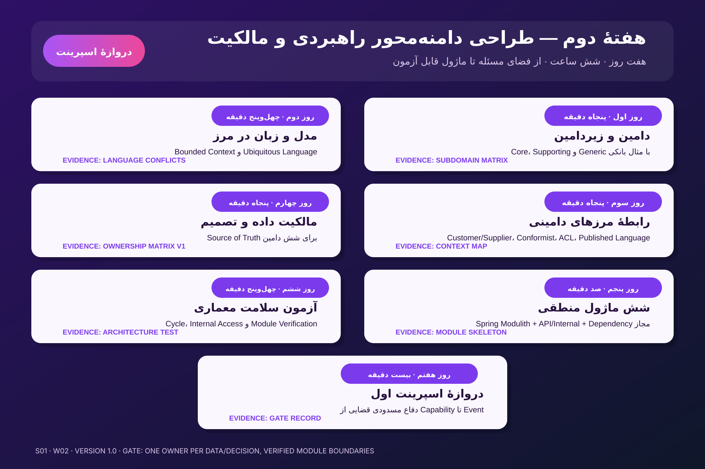

# Week 02 — Strategic DDD و مالکیت

- Status: **Ready**
- Time budget: **360 minutes**
- Banking lens: اعطای تسهیلات، واریز به سپرده و مسدودی قضایی
- Main question: هر مدل، داده و تصمیم در کدام Bounded Context معنا و مالک دارد؟
- Technical outcome: شش Application Module قابل Verification در Spring Modulith

## چرا این هفته وجود دارد؟

در Week 01 یاد گرفتیم از Capability و مسئلهٔ کسب‌وکاری به Contract برسیم و نباید از جدول، سامانه یا Microservice شروع کنیم. Week 02 پاسخ می‌دهد که **مرزهای مدل کجا هستند، رابطهٔ آن‌ها چیست و چه کسی حق تصمیم‌گیری و تغییر هر Fact را دارد**.

این هفته هنوز طراحی Microservice یا تراکنش توزیع‌شده نیست. شش ماژول Java یک **فرضیهٔ اجرایی و قابل‌آزمون دربارهٔ مرزها** هستند؛ نه اثبات اینکه بانک باید دقیقاً شش سرویس مستقل داشته باشد.

## پیش‌نیاز واقعی

پیش از شروع، باید بتوانی بدون مراجعه به Week 01 توضیح بدهی:

1. Capability با Process، Application و API یکی نیست.
2. Domain، Bounded Context، Module و Deployable Service چهار مفهوم متفاوت‌اند.
3. BIAN Service Domain به‌طور خودکار Microservice نمی‌شود.
4. Command قصد انجام کار و Event واقعیت رخ‌داده را بیان می‌کند.

اگر Exit Ticket روز اول Week 01 هنوز Review نشده است، می‌توانی محتوای این هفته را ببینی، اما Gate اسپرینت را انجام نده.

## قانون اجرای هفته

برای هر روز همین ترتیب را رعایت کن:

1. درس همان روز را یک‌بار پیوسته بخوان.
2. مثال هدایت‌شده را با کاغذ یا فایل بازسازی کن.
3. تمرین مستقل را در Workbook انجام بده.
4. درس را ببند و Exit Ticket را بدون مراجعه پاسخ بده.
5. فقط پس از Review استاد، Artifact را `Accepted` یا روز را `Done` اعلام کن.

پاسخ‌های مستقل را در [Week 02 Workbook](submissions/week-02-workbook.md) ثبت کن؛ پاسخ خام را بعد از Review پاک نکن.

## ترتیب دقیق روزها

| روز | زمان | درس | تمرین و شاهد پایان | آزمون خروج |
|---|---:|---|---|---|
| ۱ | ۵۰ دقیقه | [Domain، Subdomain و اهمیت راهبردی](lessons/day-01-domain-subdomain-strategy-fa.md) | [Subdomain Matrix](exercises/day-01-subdomain-matrix.md) | [Exit Ticket](quizzes/day-01-exit-ticket.md) |
| ۲ | ۴۵ دقیقه | [Bounded Context و Ubiquitous Language](lessons/day-02-bounded-context-language-fa.md) | [Language Conflicts](exercises/day-02-language-conflicts.md) | [Exit Ticket](quizzes/day-02-exit-ticket.md) |
| ۳ | ۵۰ دقیقه | [Context Map و الگوهای رابطه](lessons/day-03-context-map-patterns-fa.md) | [Context Relations](exercises/day-03-context-map.md) | [Exit Ticket](quizzes/day-03-exit-ticket.md) |
| ۴ | ۵۰ دقیقه | [مالکیت داده و تصمیم](lessons/day-04-ownership-source-of-truth-fa.md) | [Ownership Matrix v1](exercises/day-04-ownership-matrix.md) | [Exit Ticket](quizzes/day-04-exit-ticket.md) |
| ۵ | ۱۰۰ دقیقه | [تبدیل فرضیهٔ مرزها به Spring Modulith](lessons/day-05-spring-modulith-modules-fa.md) | [Six-module Skeleton](exercises/day-05-module-skeleton.md) | [Exit Ticket](quizzes/day-05-exit-ticket.md) |
| ۶ | ۴۵ دقیقه | [Architecture Fitness Test](lessons/day-06-architecture-fitness-test-fa.md) | [Module Verification](exercises/day-06-module-verification.md) | [Exit Ticket](quizzes/day-06-exit-ticket.md) |
| ۷ | ۲۰ دقیقه | [Gate اسپرینت اول](lessons/day-07-sprint-gate-defense-fa.md) | [دفاع مسدودی قضایی](exercises/day-07-sprint-gate.md) | Rubric داخل Gate |
| **جمع** | **۳۶۰ دقیقه** |  |  |  |

ریزبودجهٔ پیشنهادی: روزهای ۱ تا ۴ شامل ۲۰ تا ۲۵ دقیقه درس، ۱۵ تا ۲۰ دقیقه تمرین و ۵ دقیقه آزمون/مرجع‌اند؛ روز ۵ شامل ۲۰ دقیقه درس، ۷۵ دقیقه کدنویسی و ۵ دقیقه آزمون است؛ روز ۶ شامل ۱۰ دقیقه مرور، ۳۰ دقیقه Verification و ۵ دقیقه آزمون است. دفاع استاد پس از Submission جزو بودجهٔ خودخوان ۳۶۰ دقیقه‌ای حساب نشده است.

## خروجی‌های اجباری

### تحلیل و مدل

- [Subdomain Matrix working draft](artifacts/subdomain-matrix-working-draft.md)
- [Language Conflicts working draft](artifacts/language-conflicts-working-draft.md)
- [Domain Map v1](artifacts/domain-map-working-draft.md)
- [Context Map v1](artifacts/context-map-template.md)
- [Data/Decision Ownership Matrix v1](artifacts/ownership-matrix-template.md)
- شش [Domain Dossier](artifacts/domain-dossiers/README.md) اولیه

### کد و Verification

- شش Application Module منطقی: `partycustomer`، `productagreement`، `deposits`، `lending`، `payments` و `accounting`
- API آشکار و Package داخلی برای هر Module
- [Dependency Policy](artifacts/module-dependency-policy.md) با دلیل هر وابستگی
- `ApplicationModules.verify()` سبز
- یک آزمایش منفی برای Cycle یا دسترسی به Internal و ثبت شاهد شکست

### دفاع و گزارش

- [Sprint 01 Gate Evidence](artifacts/sprint-01-gate-evidence-template.md)
- [Week 02 Report](artifacts/week-02-report-template.md)
- دفاع حداکثر ده‌دقیقه‌ای از Boundary و Ownership

## Definition of Done

Week 02 زمانی Done است که:

- هر Subdomain با شواهد و Forces طبقه‌بندی شده باشد؛ نه با سلیقه یا نام سامانه.
- برای اصطلاحات مهم، Context و معنای دقیق ثبت شده باشد.
- هر رابطه در Context Map جهت، Pattern، Contract و اثر شکست داشته باشد.
- برای هر Fact یا Decision دقیقاً یک Authority مشخص باشد.
- Copy، Snapshot، Cache و Projection با Owner اشتباه نشده باشند.
- هیچ Module از Package داخلی Module دیگر استفاده نکند.
- Dependencyهای مجاز صریح باشند و Cycle وجود نداشته باشد.
- `mvn verify` سبز باشد.
- Gate اسپرینت حداقل ۸ از ۱۰ بگیرد و هیچ Critical Error نداشته باشد.

## Critical Errorهای این هفته

هرکدام از موارد زیر Gate را مستقل از جمع امتیاز متوقف می‌کند:

1. دو Context هم‌زمان Owner یک Fact با معنای یکسان معرفی شوند.
2. Accounting مالک ماندهٔ قابل برداشت یا Hold عملیاتی سپرده معرفی شود.
3. Legal Orders مجاز به Update مستقیم Hold یا ماندهٔ Deposits باشد.
4. وجود جدول، API، تیم یا BIAN Service Domain به‌تنهایی دلیل Boundary دانسته شود.
5. دسترسی مستقیم به Package داخلی یا دیتابیس مشترک به‌عنوان Contract پذیرفته شود.
6. Context Map فقط چند خط بدون جهت، Pattern و Contract باشد.

## خارج از محدوده

این موارد عمداً به هفته‌های بعد موکول شده‌اند:

- طراحی Aggregate و Invariantهای کامل Deposits
- Hexagonal Architecture و Port/Adapterهای Lending
- انتخاب REST در برابر Kafka
- Saga، Outbox، Exactly-once و Reconciliation
- طراحی فیزیکی جدول، Partitioning و Locking
- سند حسابداری دقیق هر رویداد

در Week 02 فقط به‌اندازه‌ای از این موضوعات حرف می‌زنیم که Boundary و Ownership قابل دفاع شوند.

## منابع

مسیر مطالعهٔ محدود و هدفمند در [References](references/README.md) آمده است. خواندن کل کتاب DDD یا تمام مستند Spring Modulith پیش‌نیاز نیست.
